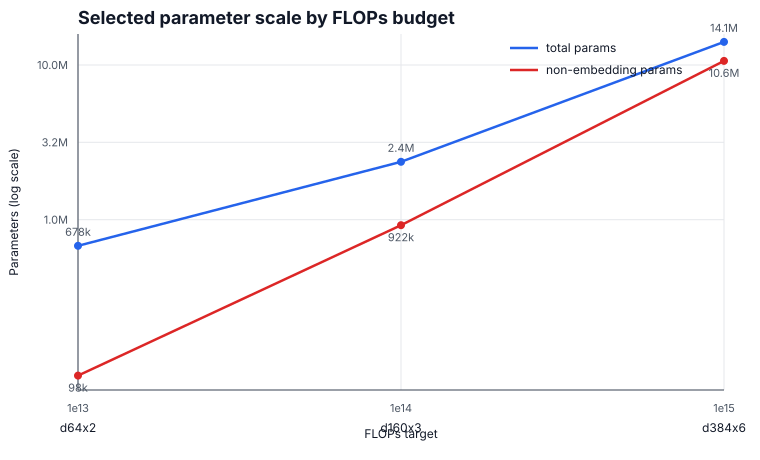
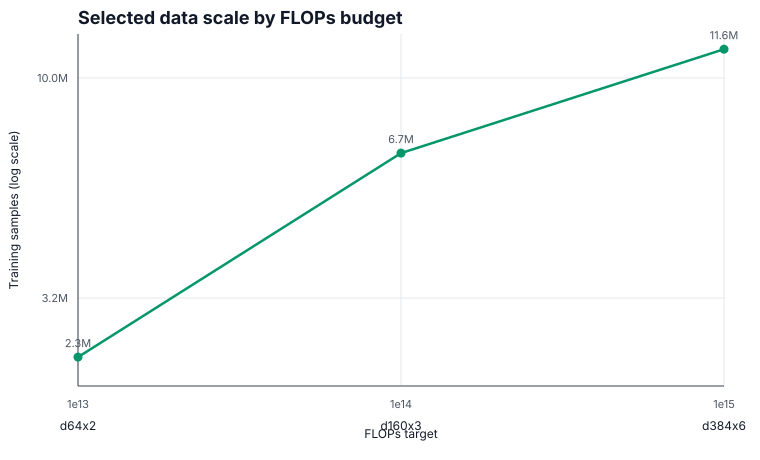

# Architecture Shape Sweep

Date: 2026-05-04
Commit: c71695a
Data: two t80 tar files in `chess-engine-4-training-data`

## Goal

Tune model shape for fixed FLOPs budgets. The budget configs are intended to
hold the best-so-far architecture and training hyperparameters for each target,
so this sweep only changed `d_model` and `depth` while keeping optimizer, batch
size, loss weights, and `mlp_ratio` fixed.

## Commands

These are the equivalent one-line commands for the candidates tested:

```sh
uv run train-modal --config configs/1e13.toml --d-model 64 --depth 2 --gpu l4
uv run train-modal --config configs/1e13.toml --d-model 128 --depth 2 --gpu l4
uv run train-modal --config configs/mlp/1e14.toml --d-model 160 --depth 3 --gpu l4
uv run train-modal --config configs/mlp/1e14.toml --d-model 256 --depth 4 --gpu l4
uv run train-modal --config configs/mlp/1e15.toml --d-model 384 --depth 6 --gpu l4
uv run train-modal --config configs/mlp/1e15.toml --d-model 512 --depth 6 --gpu l4
```

## Results

The EMA column uses a post-hoc FLOPs-progress EMA of `loss/total` with a
half-life of 5% of each run's FLOPs target. This is more comparable across model
shapes than a fixed-decay-per-step EMA because each shape takes a different
number of optimizer steps at the same FLOPs budget.

| Budget | Candidate | Params | Non-embedding params | Samples | Steps | Final loss | Loss EMA | W&B |
| --- | ---: | ---: | ---: | ---: | ---: | ---: | ---: | --- |
| 1e13 | d64x2 | 678,342 | 98,432 | 2,321,408 | 2,267 | 6.1636 | 5.7801 | https://wandb.ai/maxence-frenette/chess-engine-4/runs/1ts83gtm |
| 1e13 | d128x2 | 1,551,430 | 393,472 | 1,021,952 | 998 | 5.7040 | 6.1220 | https://wandb.ai/maxence-frenette/chess-engine-4/runs/l2sdil6k |
| 1e14 | d160x3 | 2,369,062 | 922,080 | 6,749,184 | 6,591 | 4.6256 | 4.6412 | https://wandb.ai/maxence-frenette/chess-engine-4/runs/orh9fvpn |
| 1e14 | d256x4 | 5,460,806 | 3,148,288 | 2,964,480 | 2,895 | 4.8572 | 4.8668 | https://wandb.ai/maxence-frenette/chess-engine-4/runs/ibfl7i0j |
| 1e15 | d384x6 | 14,089,286 | 10,619,136 | 11,627,520 | 11,355 | 4.5764 | 4.5604 | https://wandb.ai/maxence-frenette/chess-engine-4/runs/h1097nbe |
| 1e15 | d512x6 | 23,503,686 | 18,876,416 | 6,993,920 | 6,830 | 5.0542 | 4.6747 | https://wandb.ai/maxence-frenette/chess-engine-4/runs/om8yx7uy |

## Scaling Plot





## Config Updates

Updated the best-so-far budget configs:

- `configs/1e13.toml`: d64x2
- `configs/mlp/1e14.toml`: d160x3
- `configs/mlp/1e15.toml`: d384x6

## Next Steps

- This is not a full architecture search. The next sweep should tune learning
  rate and batch size around these selected shapes.
