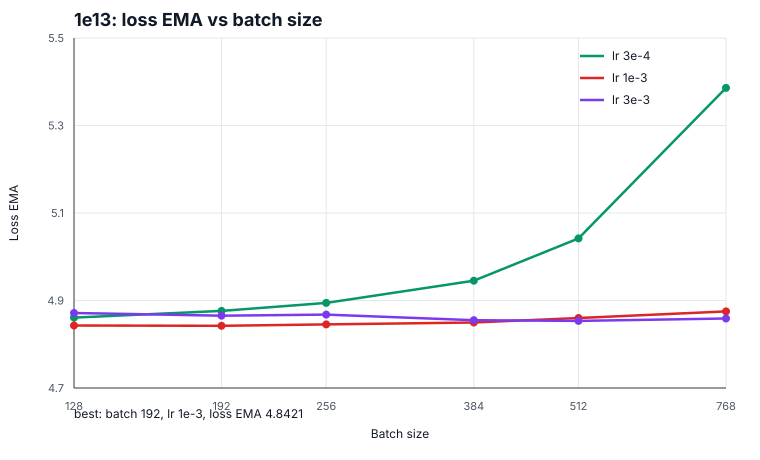
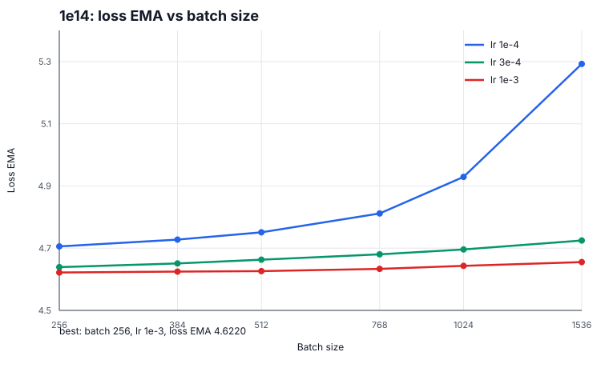
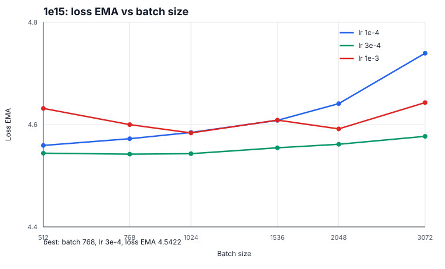
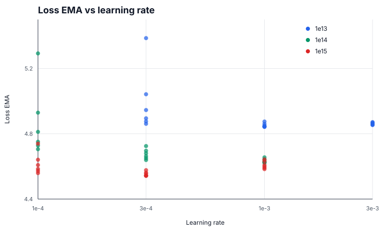
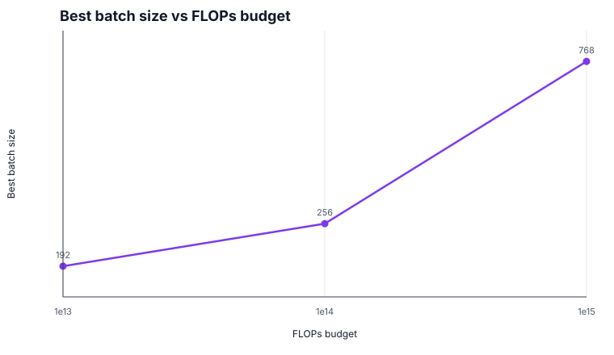
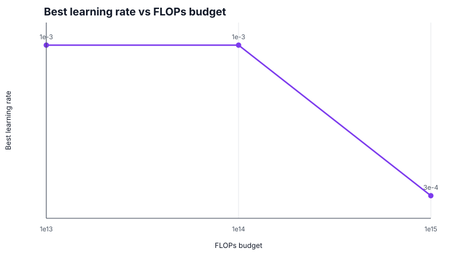
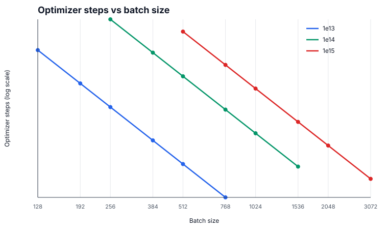

# LR and Batch Sweep

## Goal

Tune learning rate and batch size for the current best architecture at each FLOPs budget, using `loss/total_ema` as the comparison metric.

This sweep ran 54 Modal jobs:

- 3 FLOPs budgets: `1e13`, `1e14`, `1e15`
- 6 batch sizes per budget
- 3 learning rates per budget

The exact command list is in `commands.txt`; the compact metric export is in `results.csv`.

## Sweep Grid

| Budget | Config | Model | Batch sizes | Learning rates |
| --- | --- | --- | --- | --- |
| `1e13` | `configs/1e13.toml` | `d64x2` | `128, 192, 256, 384, 512, 768` | `3e-4, 1e-3, 3e-3` |
| `1e14` | `configs/1e14.toml` | `d160x3` | `256, 384, 512, 768, 1024, 1536` | `1e-4, 3e-4, 1e-3` |
| `1e15` | `configs/1e15.toml` | `d384x6` | `512, 768, 1024, 1536, 2048, 3072` | `1e-4, 3e-4, 1e-3` |

Runs were launched in parallel with up to 6 local Modal launchers active at once.

## Best Results

| Budget | Best run | Batch size | LR | `loss/total_ema` | Final loss | W&B |
| --- | --- | ---: | ---: | ---: | ---: | --- |
| `1e13` | `lrbs-1e13-b192-lr1e-3` | 192 | `1e-3` | 4.8421 | 5.5942 | [run](https://wandb.ai/maxence-frenette/chess-engine-4/runs/ilkvziij) |
| `1e14` | `lrbs-1e14-b256-lr1e-3` | 256 | `1e-3` | 4.6220 | 4.6861 | [run](https://wandb.ai/maxence-frenette/chess-engine-4/runs/2zlyjs55) |
| `1e15` | `lrbs-1e15-b768-lr3e-4` | 768 | `3e-4` | 4.5422 | 4.5291 | [run](https://wandb.ai/maxence-frenette/chess-engine-4/runs/ezazcin8) |

These results were copied back into the baseline config files.

## Batch Size vs Loss EMA

## Cross-Budget Views

## Notes

The best 1e13 and 1e14 runs landed at smaller batches than the prior defaults. That suggests the earlier configs were spending too much of the fixed FLOPs budget on batch size and not enough on optimizer updates.

The 1e13 sweep is fairly flat around batch `128` to `384` at `1e-3`, so `192` should be treated as the current baseline, not a precisely pinned optimum.

The 1e14 sweep has a clearer direction: `1e-3` is best across the full batch ladder, and the smallest tested batch wins on EMA. A follow-up should test `128` and `192` before assuming `256` is optimal.

The 1e15 sweep prefers `3e-4` and is also fairly flat from batch `512` to `1024`, with `768` narrowly best. `1e-3` is consistently worse at this scale.

The next useful refinement is a narrower sweep around the current winners:

- `1e13`: batch `128, 160, 192, 224, 256`, LR `7e-4, 1e-3, 1.5e-3`
- `1e14`: batch `128, 192, 256, 384`, LR `7e-4, 1e-3, 1.5e-3`
- `1e15`: batch `512, 768, 1024`, LR `2e-4, 3e-4, 5e-4`
