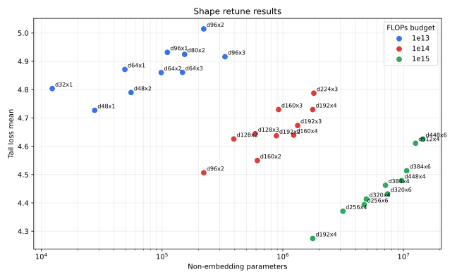
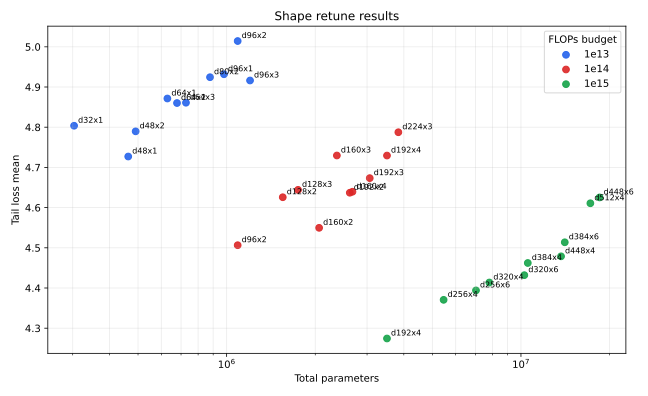

# Shape Retune After Batch/LR Sweep

Date: 2026-05-07
Data: t80 data in the Modal `chess-engine-4-training-data` volume

## Goal

Retune `d_model` and `depth` after lowering the batch sizes in the FLOPs-budget configs. The suspicion was that the previous architecture sweep had selected models that were too large for the number of optimizer updates available at each budget.

Each candidate kept the current best batch size and learning rate for its FLOPs budget. The optimized metric is now the mean of the last 100 W&B `loss/total` history values, computed post-hoc. Policy top-1 is summarized the same way from `metrics/policy_top1`.

## Commands

The planned commands are listed in `commands.txt`. All 30 candidates completed to target.

## Results

| Budget | Shape | Params | Non-embedding params | Batch | LR | Steps | Samples | FLOPs seen | Tail loss | Tail policy top-1 | W&B |
| --- | ---: | ---: | ---: | ---: | ---: | ---: | ---: | ---: | ---: | ---: | --- |
| 1e13 | d48x1 | 463,094 | 27,696 | 192 | 1e-03 | 17,616 | 3,382,272 | 1.00e+13 | 4.7271 | 0.2202 | [run](https://wandb.ai/maxence-frenette/chess-engine-4/runs/fn34qq8s) |
| 1e13 | d48x2 | 490,790 | 55,392 | 192 | 1e-03 | 16,674 | 3,201,408 | 1.00e+13 | 4.7898 | 0.2208 | [run](https://wandb.ai/maxence-frenette/chess-engine-4/runs/qfyjy6lz) |
| 1e13 | d32x1 | 303,206 | 12,320 | 192 | 1e-03 | 26,883 | 5,161,536 | 1.00e+13 | 4.8037 | 0.2244 | [run](https://wandb.ai/maxence-frenette/chess-engine-4/runs/2zi5hubr) |
| 1e13 | d64x2 | 678,342 | 98,432 | 192 | 1e-03 | 12,087 | 2,320,704 | 1.00e+13 | 4.8602 | 0.2193 | [run](https://wandb.ai/maxence-frenette/chess-engine-4/runs/ocnbu3pa) |
| 1e13 | d64x3 | 727,558 | 147,648 | 192 | 1e-03 | 11,309 | 2,171,328 | 1.00e+13 | 4.8609 | 0.2142 | [run](https://wandb.ai/maxence-frenette/chess-engine-4/runs/8dessdha) |
| 1e13 | d64x1 | 629,126 | 49,216 | 192 | 1e-03 | 12,980 | 2,492,160 | 1.00e+13 | 4.8715 | 0.2284 | [run](https://wandb.ai/maxence-frenette/chess-engine-4/runs/cbfw9rbp) |
| 1e13 | d96x3 | 1,200,998 | 332,064 | 192 | 1e-03 | 6,883 | 1,321,536 | 1.00e+13 | 4.9163 | 0.2006 | [run](https://wandb.ai/maxence-frenette/chess-engine-4/runs/4vc1znjv) |
| 1e13 | d80x2 | 878,182 | 153,760 | 192 | 1e-03 | 9,354 | 1,795,968 | 1.00e+13 | 4.9245 | 0.2186 | [run](https://wandb.ai/maxence-frenette/chess-engine-4/runs/wwf0m3db) |
| 1e13 | d96x1 | 979,622 | 110,688 | 192 | 1e-03 | 8,353 | 1,603,776 | 1.00e+13 | 4.9318 | 0.2031 | [run](https://wandb.ai/maxence-frenette/chess-engine-4/runs/oeyh5t6d) |
| 1e13 | d96x2 | 1,090,310 | 221,376 | 192 | 1e-03 | 7,547 | 1,449,024 | 1.00e+13 | 5.0144 | 0.1964 | [run](https://wandb.ai/maxence-frenette/chess-engine-4/runs/n3csev4f) |
| 1e14 | d96x2 | 1,090,310 | 221,376 | 256 | 1e-03 | 56,600 | 14,489,600 | 1.00e+14 | 4.5065 | 0.2867 | [run](https://wandb.ai/maxence-frenette/chess-engine-4/runs/q6724yl8) |
| 1e14 | d160x2 | 2,061,702 | 614,720 | 256 | 1e-03 | 30,116 | 7,709,696 | 1.00e+14 | 4.5497 | 0.2804 | [run](https://wandb.ai/maxence-frenette/chess-engine-4/runs/j05jp8mr) |
| 1e14 | d128x2 | 1,551,430 | 393,472 | 256 | 1e-03 | 39,906 | 10,215,936 | 1.00e+14 | 4.6258 | 0.2871 | [run](https://wandb.ai/maxence-frenette/chess-engine-4/runs/6na5pn8d) |
| 1e14 | d192x2 | 2,621,126 | 885,120 | 256 | 1e-03 | 23,750 | 6,080,000 | 1.00e+14 | 4.6370 | 0.2747 | [run](https://wandb.ai/maxence-frenette/chess-engine-4/runs/07yt4l18) |
| 1e14 | d160x4 | 2,676,422 | 1,229,440 | 256 | 1e-03 | 23,440 | 6,000,640 | 1.00e+14 | 4.6395 | 0.2724 | [run](https://wandb.ai/maxence-frenette/chess-engine-4/runs/0k1mptrn) |
| 1e14 | d128x3 | 1,748,166 | 590,208 | 256 | 1e-03 | 35,604 | 9,114,624 | 1.00e+14 | 4.6442 | 0.2910 | [run](https://wandb.ai/maxence-frenette/chess-engine-4/runs/i880wqtl) |
| 1e14 | d192x3 | 3,063,686 | 1,327,680 | 256 | 1e-03 | 20,445 | 5,233,920 | 1.00e+14 | 4.6734 | 0.2593 | [run](https://wandb.ai/maxence-frenette/chess-engine-4/runs/1ii0t385) |
| 1e14 | d192x4 | 3,506,246 | 1,770,240 | 256 | 1e-03 | 17,947 | 4,594,432 | 1.00e+14 | 4.7295 | 0.2535 | [run](https://wandb.ai/maxence-frenette/chess-engine-4/runs/tmffa335) |
| 1e14 | d160x3 | 2,369,062 | 922,080 | 256 | 1e-03 | 26,362 | 6,748,672 | 1.00e+14 | 4.7297 | 0.2711 | [run](https://wandb.ai/maxence-frenette/chess-engine-4/runs/t1llg0ej) |
| 1e14 | d224x3 | 3,832,038 | 1,807,008 | 256 | 1e-03 | 16,387 | 4,195,072 | 1.00e+14 | 4.7875 | 0.2470 | [run](https://wandb.ai/maxence-frenette/chess-engine-4/runs/eyhxsy0m) |
| 1e15 | d192x4 | 3,506,246 | 1,770,240 | 768 | 3e-04 | 59,823 | 45,944,064 | 1.00e+15 | 4.2745 | 0.3417 | [run](https://wandb.ai/maxence-frenette/chess-engine-4/runs/hbfybm6d) |
| 1e15 | d256x4 | 5,460,806 | 3,146,752 | 768 | 3e-04 | 38,596 | 29,641,728 | 1.00e+15 | 4.3706 | 0.3419 | [run](https://wandb.ai/maxence-frenette/chess-engine-4/runs/8aoxlknh) |
| 1e15 | d256x6 | 7,034,182 | 4,720,128 | 768 | 3e-04 | 30,151 | 23,155,968 | 1.00e+15 | 4.3941 | 0.3321 | [run](https://wandb.ai/maxence-frenette/chess-engine-4/runs/4lyw0nxz) |
| 1e15 | d320x4 | 7,808,582 | 4,916,480 | 768 | 3e-04 | 27,090 | 20,805,120 | 1.00e+15 | 4.4137 | 0.3239 | [run](https://wandb.ai/maxence-frenette/chess-engine-4/runs/290nonbs) |
| 1e15 | d320x6 | 10,266,822 | 7,374,720 | 768 | 3e-04 | 20,725 | 15,916,800 | 1.00e+15 | 4.4320 | 0.3176 | [run](https://wandb.ai/maxence-frenette/chess-engine-4/runs/d522c280) |
| 1e15 | d384x4 | 10,549,574 | 7,079,424 | 768 | 3e-04 | 20,108 | 15,442,944 | 1.00e+15 | 4.4623 | 0.3192 | [run](https://wandb.ai/maxence-frenette/chess-engine-4/runs/w6e6590b) |
| 1e15 | d448x4 | 13,683,782 | 9,635,584 | 768 | 3e-04 | 15,538 | 11,933,184 | 1.00e+15 | 4.4788 | 0.3003 | [run](https://wandb.ai/maxence-frenette/chess-engine-4/runs/ero2h7kw) |
| 1e15 | d384x6 | 14,089,286 | 10,619,136 | 768 | 3e-04 | 15,139 | 11,626,752 | 1.00e+15 | 4.5138 | 0.2973 | [run](https://wandb.ai/maxence-frenette/chess-engine-4/runs/n9tbpjx5) |
| 1e15 | d512x4 | 17,211,206 | 12,584,960 | 768 | 3e-04 | 12,376 | 9,504,768 | 1.00e+15 | 4.6108 | 0.2820 | [run](https://wandb.ai/maxence-frenette/chess-engine-4/runs/zwdb3sz6) |
| 1e15 | d448x6 | 18,501,574 | 14,453,376 | 768 | 3e-04 | 11,551 | 8,871,168 | 1.00e+15 | 4.6253 | 0.2792 | [run](https://wandb.ai/maxence-frenette/chess-engine-4/runs/vsnc47xp) |

## Plot

## Outcome

| Budget | Previous best | New best | Non-embedding params change | Metric change |
| --- | ---: | ---: | ---: | ---: |
| 1e13 | d64x2 | d48x1 | 98,432 -> 27,696 (0.28x) | 4.8421 EMA -> 4.7271 tail (-0.1150) |
| 1e14 | d160x3 | d96x2 | 922,080 -> 221,376 (0.24x) | 4.6220 EMA -> 4.5065 tail (-0.1155) |
| 1e15 | d384x6 | d192x4 | 10,619,136 -> 1,770,240 (0.17x) | 4.5422 EMA -> 4.2745 tail (-0.2678) |

The tail-loss metric still supports the concern that the prior scaling trend was over-allocating parameters. All three budgets prefer substantially smaller models than the previous baselines. The `1e13` winner changes from `d32x1` under EMA to `d48x1` under tail mean, so `d48x1` is now the baseline for that budget.

Updated best-so-far state:

- `configs/1e13.toml`: `d48x1`
- `configs/mlp/1e14.toml`: `d96x2`
- `configs/mlp/1e15.toml`: `d192x4`
- `experiments/best-runs-mlp.toml`: points at the three winning W&B runs using post-hoc tail metrics

## Next Steps

Rerun 1e14 and 1e15 with even smaller model shapes.
