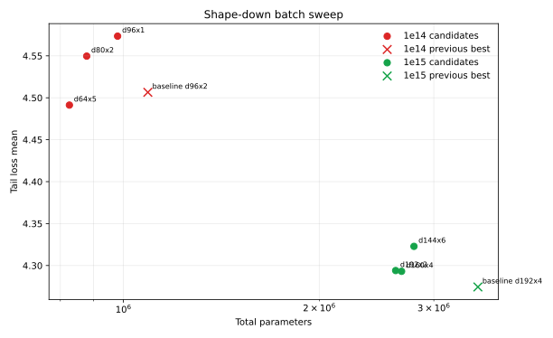

# Shape-Down Batch Sweep

Date: 2026-05-07

## Goal

Test smaller total-parameter model shapes for `1e14` and `1e15` while increasing batch size enough to keep optimizer steps below 100k. Learning rate was scaled inversely with the square root of batch size from the current baseline recipe.

The shape prior was a target data/parameter ratio near 20, using total parameters as the size metric.

## Commands

The launched commands are listed in `commands.txt`.

## Results

| Budget | Shape | Params | Batch | LR | Steps | Samples | Data/param | Tail loss | Tail policy top-1 | Runtime | W&B |
| --- | ---: | ---: | ---: | ---: | ---: | ---: | ---: | ---: | ---: | ---: | --- |
| 1e14 | d64x5 | 825,990 | 512 | 0.000707 | 37,569 | 19,235,328 | 23.3 | 4.4913 | 0.2872 | 16.0m | [run](https://wandb.ai/maxence-frenette/chess-engine-4/runs/q4jwdjdy) |
| 1e14 | d80x2 | 878,182 | 512 | 0.000707 | 35,074 | 17,957,888 | 20.4 | 4.5497 | 0.2925 | 14.3m | [run](https://wandb.ai/maxence-frenette/chess-engine-4/runs/m4fw8zxi) |
| 1e14 | d96x1 | 979,622 | 512 | 0.000707 | 31,322 | 16,036,864 | 16.4 | 4.5735 | 0.2900 | 11.8m | [run](https://wandb.ai/maxence-frenette/chess-engine-4/runs/n1jrjsxq) |
| 1e15 | d160x4 | 2,676,422 | 1,536 | 0.000212 | 39,066 | 60,005,376 | 22.4 | 4.2931 | 0.3384 | 49.2m | [run](https://wandb.ai/maxence-frenette/chess-engine-4/runs/s0vq6eql) |
| 1e15 | d192x2 | 2,621,126 | 1,536 | 0.000212 | 39,583 | 60,799,488 | 23.2 | 4.2940 | 0.3405 | 51.0m | [run](https://wandb.ai/maxence-frenette/chess-engine-4/runs/8qcg45bf) |
| 1e15 | d144x6 | 2,796,326 | 1,536 | 0.000212 | 37,569 | 57,705,984 | 20.6 | 4.3229 | 0.3419 | 52.4m | [run](https://wandb.ai/maxence-frenette/chess-engine-4/runs/g4gp4xll) |

## Baseline Comparison

| Budget | Previous best | Previous tail loss | Best new run | New tail loss | Outcome |
| --- | ---: | ---: | ---: | ---: | --- |
| 1e14 | d96x2, batch 256, lr 1e-3 | 4.5065 | d64x5, batch 512, lr 7.07e-4 | 4.4913 | Improved |
| 1e15 | d192x4, batch 768, lr 3e-4 | 4.2745 | d160x4, batch 1536, lr 2.12e-4 | 4.2931 | Did not improve |

## Plot

## Takeaways

- `1e14` benefits from moving smaller and deeper: `d64x5` at batch 512 beats the previous `d96x2` baseline.
- `1e15` did not improve from these smaller candidates. The current `d192x4` baseline remains best, though `d160x4` and `d192x2` are close enough that LR/batch may be worth revisiting.
- The larger batch did keep step counts reasonable: about 31k-38k steps for `1e14` and 38k-40k steps for `1e15`.
