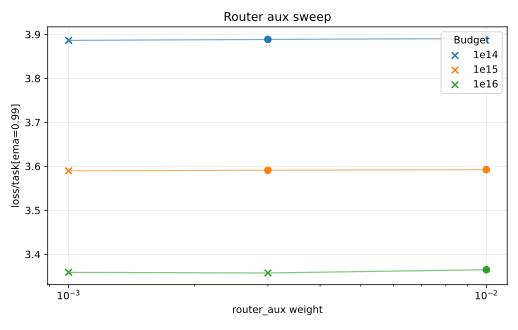

# MLP-MoE16A2 Router Aux EMA Sweep

This sweep reran the current `mlp_moe16a2` baselines at three router auxiliary loss weights for each compute budget: `0.001`, `0.003`, and `0.01`.

The comparison metric is the W&B summary value `loss/task[ema=0.99]`. This is the task loss EMA and excludes the weighted router auxiliary loss. A run is only eligible as a best run if final `loss/aux/router < 1.5`; otherwise, the router is not using the experts evenly enough. The raw final `loss`, `loss/train`, and `loss/aux/router` values are recorded in `results.csv` for debugging.

## Results

| Budget | Best router aux | Loss | Policy top-1 | W&B |
| --- | ---: | ---: | ---: | --- |
| `1e14` | `0.003` | `3.8886` | `0.2426` | https://wandb.ai/maxence-frenette/chess-engine-4/runs/dfk2w9fo |
| `1e15` | `0.003` | `3.5910` | `0.3047` | https://wandb.ai/maxence-frenette/chess-engine-4/runs/fzh63fln |
| `1e16` | `0.01` | `3.3648` | `0.3696` | https://wandb.ai/maxence-frenette/chess-engine-4/runs/wbsxtgj1 |

## Takeaways

- The unconstrained task-loss winners at `1e14` and `1e15` use `router_aux = 0.001`, but both have raw router loss above `1.5`, so they are rejected.
- `1e14` and `1e15` use `router_aux = 0.003` under the router-utilization constraint.
- The unconstrained `1e16` winner uses `router_aux = 0.003`, but its raw router loss is still around `1.79`; the only eligible run is `router_aux = 0.01`.
- The best-runs file now points to the best eligible EMA-based runs, and the `mlp_moe16a2` configs were updated to these router aux weights.
