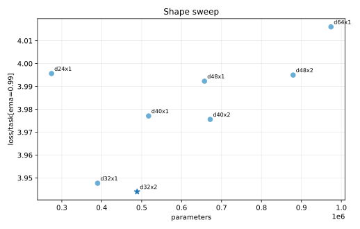
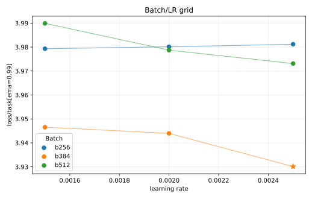

# MLP-MoE16A2 K1.5 1e15 Tuning

This experiment tunes the newly renamed `configs/mlp_moe16a2/1e15.toml` budget after switching the MoE family to `step_penalty_k = 1.5`.

Selection uses `loss/task[ema=0.99]`. Router utilization is still tracked with final `loss/aux/router`, but the `1.63` router-loss point at this scale is acceptable because it is only slightly above the earlier diagnostic threshold and gives a clear task-loss win.

## Result

The selected run is `d32x2`, batch `384`, LR `2.5e-3`:

| Run | Loss | Policy top-1 | Router loss | W&B |
| --- | ---: | ---: | ---: | --- |
| `moe16a2-k15-grid-1e15-d32x2-b384-lr2.5e-3` | `3.9301` | `0.2243` | `1.6318` | https://wandb.ai/maxence-frenette/chess-engine-4/runs/uxe3hy3w |

The stricter `loss/aux/router < 1.5` rule would have selected `d32x2`, batch `384`, LR `2e-3` with loss `3.9440`, but the `2.5e-3` run is better enough to keep.

## Takeaways

- The model should be deeper than the inherited `d32x1` config at this budget. `d32x2` beats `d32x1` by about `0.0037` task-loss EMA while staying router-eligible.
- Increasing width did not help at fixed batch and LR; the shape sweep got worse above `d32`.
- The batch/LR grid improved the selected run by increasing LR from `2e-3` to `2.5e-3` at the same batch size.
- The `1e15` config now uses `d32x2`, batch `384`, LR `2.5e-3`, router aux `0.003`.
