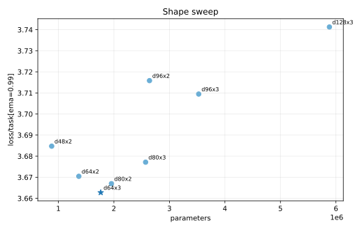
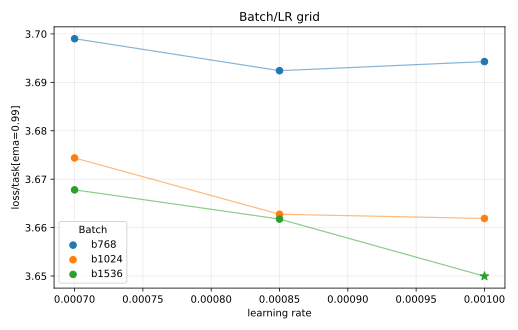

# MLP-MoE16A2 K1.5 1e16 Tuning

This experiment repeats the `1e15` tuning process for the renamed `configs/mlp_moe16a2/1e16.toml` budget after switching the MoE family to `step_penalty_k = 1.5`.

Selection uses `loss/task[ema=0.99]`. Router utilization is tracked with final `loss/aux/router`; all selected candidates stayed in a reasonable range.

## Result

The selected run is `d64x3`, batch `1536`, LR `1e-3`:

| Run | Loss | Policy top-1 | Router loss | W&B |
| --- | ---: | ---: | ---: | --- |
| `moe16a2-k15-grid-1e16-d64x3-b1536-lr1e-3` | `3.6500` | `0.2947` | `1.3324` | https://wandb.ai/maxence-frenette/chess-engine-4/runs/mwqr7fg2 |

## Takeaways

- The shape sweep preferred `d64x3` over the inherited `d64x2`, improving loss from `3.6704` to `3.6628`.
- Larger widths at depth 3 were worse at this budget, and router loss also rose as the model widened.
- The batch/LR grid found a better point by increasing batch size to `1536` and LR to `1e-3`.
- The `1e16` config now uses `d64x3`, batch `1536`, LR `1e-3`, router aux `0.003`.
