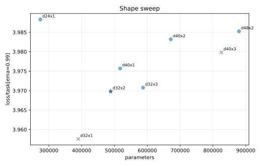
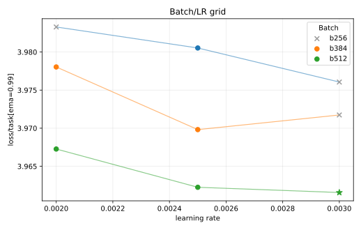

# MLP-MoE16A2 1e17 Tuning

This experiment tunes the smallest current MoE config, `configs/mlp_moe16a2/1e17.toml`.

Selection uses `loss/task[ema=0.99]` and is strict about router utilization: final `loss/aux/router` must be below `1.5`.

## Result

The selected run is `d32x2`, batch `512`, LR `3e-3`:

| Run | Loss | Policy top-1 | Router loss | W&B |
| --- | ---: | ---: | ---: | --- |
| `moe16a2-grid-1e17-d32x2-b512-lr3e-3` | `3.9616` | `0.2268` | `1.3233` | https://wandb.ai/maxence-frenette/chess-engine-4/runs/6phz8dux |

## Takeaways

- The unconstrained best shape was `d32x1`, but it is rejected because final router loss was `2.2492`.
- The best strict-eligible shape was `d32x2`.
- The batch/LR grid favored the largest tested batch and LR: `b512/lr3e-3`.
- The selected run has lower loss than the shape-sweep default and keeps router loss comfortably below `1.5`.
