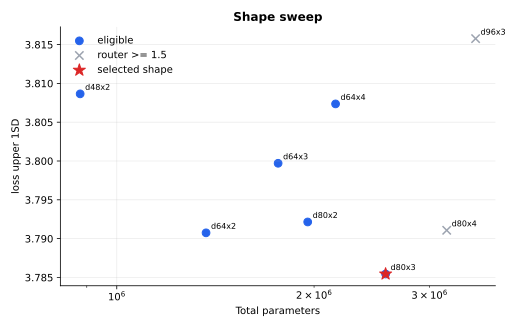
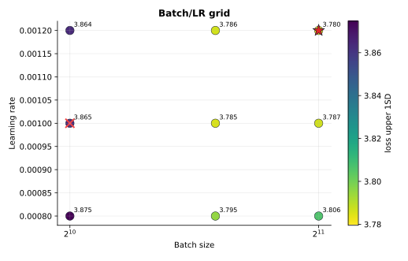

# MLP-MoE16A2 1e18 Tuning

This experiment tunes `configs/mlp_moe16a2/1e18.toml`.

Selection uses `loss_upper_1sd = loss + loss_std`, computed from `loss/task[ema=0.99]` and `loss/task2[ema=0.99]`. Runs must also finish with `loss/aux/router < 1.5`.

## Result

The selected run is `d80x3`, batch `2048`, LR `1.2e-3`:

| Run | Loss | Std | Upper 1SD | Policy top-1 | Router loss | W&B |
| --- | ---: | ---: | ---: | ---: | ---: | --- |
| `moe16a2-grid-1e18-d80x3-b2048-lr1.2e-3` | `3.6472` | `0.1323` | `3.7795` | `0.2964` | `1.3802` | https://wandb.ai/maxence-frenette/chess-engine-4/runs/d8757tq1 |

## Takeaways

- Shape tuning selected `d80x3`; it had the best strict-eligible `loss_upper_1sd`.
- Wider/deeper variants started to violate the router-loss cutoff or had worse upper-bound loss.
- The batch/LR grid preferred the largest tested batch and LR: `b2048/lr1.2e-3`.
- The selected run has both the lowest strict-eligible upper-bound loss and the best policy top-1 in the grid.
