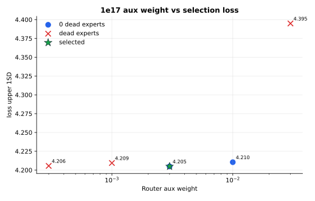
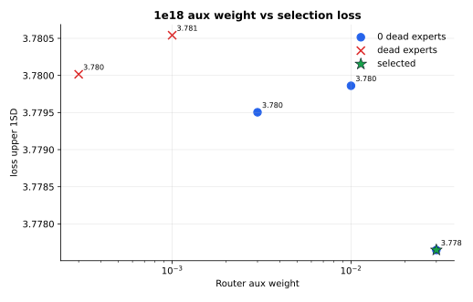
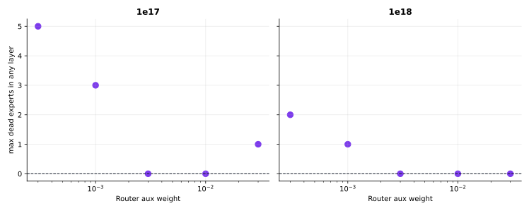

# MLP-MoE16A2 Router Aux Dead-Expert Sweep

This experiment tunes only `[loss].router_aux` for the current `1e17` and `1e18` MoE configs.

Selection uses `loss_upper_1sd = loss + loss_std`, computed from `loss/task[ema=0.99]` and `loss/task2[ema=0.99]`. A run is valid only when the final `router/dead_experts_max` is `0`, meaning every layer routed at least one token to every expert at the final logged step.

## Results

| Budget | Selected aux | Loss | Std | Upper 1SD | Policy top-1 | Dead experts | W&B |
| --- | ---: | ---: | ---: | ---: | ---: | ---: | --- |
| `1e17` | `0.003` | `3.9616` | `0.2434` | `4.2049` | `0.2268` | `0.0` | https://wandb.ai/maxence-frenette/chess-engine-4/runs/p46oltfc |
| `1e18` | `0.03` | `3.6452` | `0.1324` | `3.7776` | `0.2995` | `0.0` | https://wandb.ai/maxence-frenette/chess-engine-4/runs/pps1i1t5 |

## Takeaways

- `1e17` isn't able to get 0 dead experts. The config should be removed.
- `1e18` benefits from stronger router pressure. Among valid runs, `0.03` had the lowest `loss_upper_1sd` and best policy top-1.
- The old `loss/aux/router < 1.5` rule would reject some useful runs and accept the wrong failure mode. The dead-expert metric is a cleaner validity gate for this sweep.
