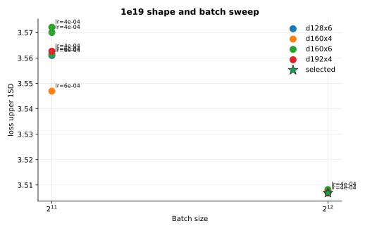
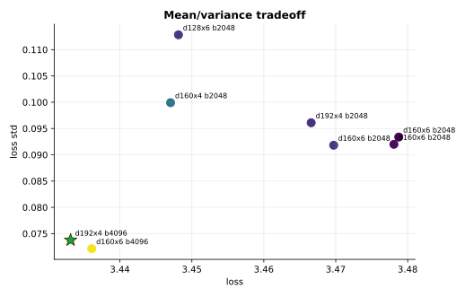

# MLP-MoE16A2 1e19 Tuning

This experiment tunes the live `1e19` MoE config under the current selection rule: minimize `loss_upper_1sd = loss + loss_std`, while requiring `router/dead_experts_max = 0` at the final logged step.

## Result

The selected run is `d192x4`, batch `4096`, LR `4e-4`, router aux `0.03`:

| Run | Loss | Std | Upper 1SD | Policy top-1 | Dead experts | W&B |
| --- | ---: | ---: | ---: | ---: | ---: | --- |
| `moe16a2-tune-1e19-d192x4-b4096-lr4e-4-a3e-2` | `3.4331` | `0.0738` | `3.5069` | `0.3515` | `0.0` | https://wandb.ai/maxence-frenette/chess-engine-4/runs/9uz0fda2 |

## Takeaways

- All completed first-pass runs ended with zero dead experts, so the selection criterion was driven by `loss_upper_1sd`.
- Larger batch size was the clearest win. Both `d160x6` and `d192x4` improved sharply going from batch `2048` to `4096`.
- `d192x4/b4096/lr4e-4` narrowly beat `d160x6/b4096/lr4e-4` on the upper-bound loss and also had the best policy top-1.
- A small second pass tested even larger batch and an alternate `d160x4` high-batch setting, but those jobs were stopped to stay inside the wall-clock budget.

## Budget Notes

The completed first pass used eight parallel Modal jobs. The second pass was intentionally stopped when it exceeded the remaining wall-clock budget, so it is recorded in `results.csv` and `commands.txt` but not used for selection.
