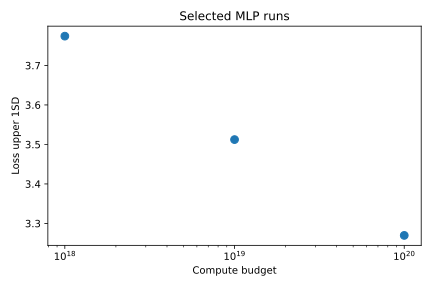
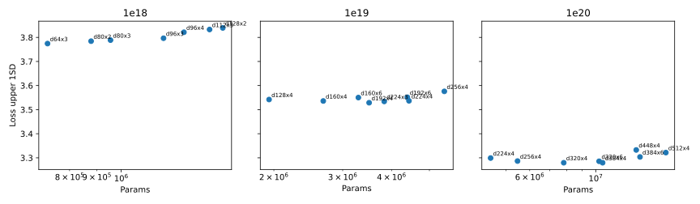
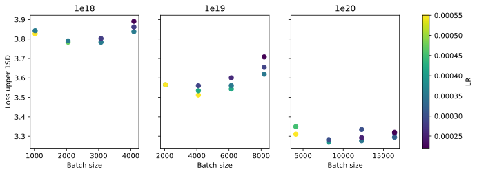

# MLP Retune

This experiment retuned the dense MLP baselines after the native dataloader speedups. The goal was to retune `1e18`, retune `1e19`, then add and tune a new `1e20` config.

Selection used `loss_upper_1sd = loss/task[ema=0.99] + std(loss/task[ema=0.99])`, where the std is computed from the EMA of `loss/task2`.

## Selected Runs

| Budget | Shape | Batch | LR | Params | Samples | Loss | Std | Upper 1SD | Policy top-1 | W&B |
| --- | ---: | ---: | ---: | ---: | ---: | ---: | ---: | ---: | ---: | --- |
| `1e18` | `d64x3` | 2,048 | 1.2e-3 | 727,302 | 21,100,544 | 3.6625 | 0.1118 | 3.7743 | 0.2836 | [run](https://wandb.ai/maxence-frenette/chess-engine-4/runs/crt0w4ou) |
| `1e19` | `d192x4` | 4,096 | 5e-4 | 3,505,286 | 43,388,928 | 3.4319 | 0.0804 | 3.5123 | 0.3427 | [run](https://wandb.ai/maxence-frenette/chess-engine-4/runs/lwlgt15o) |
| `1e20` | `d384x4` | 8,192 | 4e-4 | 10,547,654 | 112,484,352 | 3.2280 | 0.0416 | 3.2696 | 0.3949 | [run](https://wandb.ai/maxence-frenette/chess-engine-4/runs/0vvclxrb) |

## Shape Sweeps

`1e18` moved down to `d64x3`. The smaller model beat both the previous `d80x3` style baseline and the slightly larger candidates under the current compute-budget penalty.

`1e19` stayed near `d192x4`. Wider and deeper variants did not improve the upper-bound loss enough to justify moving the baseline.

`1e20` was close between `d320x4` and `d384x4` in the shape sweep. `d384x4` was selected because it had the lowest upper-bound loss before the batch/LR pass, and it improved further in the grid.

## Batch And LR

The `1e18` batch/LR grid did not beat the best shape-sweep run, so the selected baseline remains `d64x3`, batch 2048, LR 1.2e-3.

For `1e19`, increasing LR from 4e-4 to 5e-4 at batch 4096 improved both loss and policy top-1, so the config was updated.

For `1e20`, batch 8192 with LR 4e-4 was best. Larger batches increased the upper-bound loss, mostly through higher noise, so the new baseline does not push batch size further yet.

## Commands

The one-line commands for all runs are in [commands.txt](commands.txt). Full metrics are in [results.csv](results.csv).
