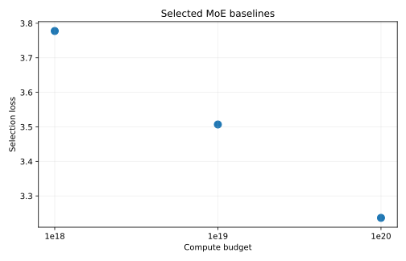
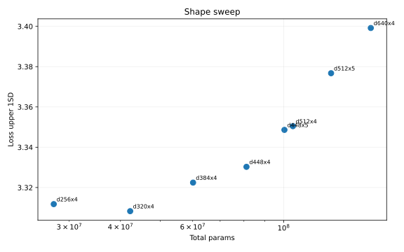
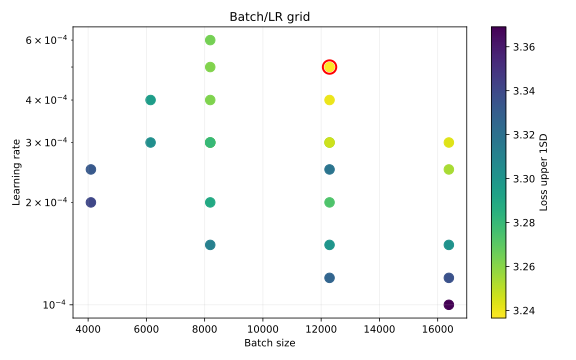

# MLP-MoE16a2 1e20 Retune

This experiment added and tuned the `mlp_moe16a2` `1e20` baseline after the native dataloader speedups. Selection used `loss_upper_1sd = loss/task[ema=0.99] + std(loss/task[ema=0.99])`, with zero dead experts required at the end of the run.

## Selected Run

| Budget | Shape | Batch | LR | Router aux | Params | Samples | Loss | Std | Upper 1SD | Policy top-1 | Dead experts | W&B |
| --- | ---: | ---: | ---: | ---: | ---: | ---: | ---: | ---: | ---: | ---: | ---: | --- |
| `1e20` | `d320x4` | 12,288 | 5e-4 | 0.03 | 42,233,862 | 159,694,848 | 3.1998 | 0.0367 | 3.2365 | 0.4137 | 0 | [run](https://wandb.ai/maxence-frenette/chess-engine-4/runs/2utqblr5) |

## Shape Sweep

The initial extrapolation suggested `d448x5`, but the shape sweep strongly favored smaller models. `d320x4` was the best shape at the initial LR, with `d256x4` close behind. Larger shapes had worse loss and higher noise even though all candidates kept zero dead experts.

## Batch And LR

The first grid moved the best run from batch 8192 / LR 1.5e-4 to batch 8192 / LR 3e-4. A second pass found batch 12288 / LR 3e-4. The final edge check improved further to batch 12288 / LR 5e-4.

Batch 16384 at LR 3e-4 was competitive on raw loss, but its higher variance made the upper-1SD score worse. The selected run is therefore `d320x4`, batch 12288, LR 5e-4.

All full-budget runs in this sweep ended with zero dead experts.

## Commands

The one-line commands for the full-budget runs are in [commands.txt](commands.txt). Full metrics are in [results.csv](results.csv).
