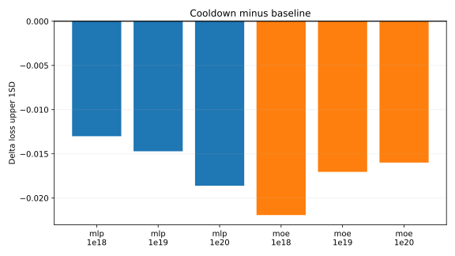
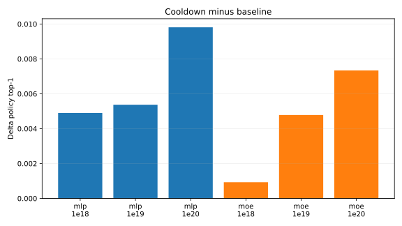

# LR Cooldown

This experiment tested a linear LR cooldown over the final 10% of training steps, ending at 10% of the peak LR. The only change from each current baseline was `lr_cooldown_frac = 0.1`.

The selection metric is `loss_upper_1sd = loss/task[ema=0.99] + std(loss/task[ema=0.99])`. For MoE runs, zero dead experts remained required.

## Results

| Family | Budget | Baseline upper 1SD | Cooldown upper 1SD | Delta | Baseline top-1 | Cooldown top-1 | Dead experts | W&B |
| --- | --- | ---: | ---: | ---: | ---: | ---: | ---: | --- |
| MLP | `1e18` | 3.7743 | 3.7613 | -0.0130 | 0.2836 | 0.2885 |  | [run](https://wandb.ai/maxence-frenette/chess-engine-4/runs/d71m5r1e) |
| MLP | `1e19` | 3.5123 | 3.4976 | -0.0147 | 0.3427 | 0.3481 |  | [run](https://wandb.ai/maxence-frenette/chess-engine-4/runs/wb4u9ota) |
| MLP | `1e20` | 3.2696 | 3.2510 | -0.0186 | 0.3949 | 0.4047 |  | [run](https://wandb.ai/maxence-frenette/chess-engine-4/runs/s2uely6i) |
| MoE16a2 | `1e18` | 3.7776 | 3.7557 | -0.0219 | 0.2995 | 0.3004 | 0 | [run](https://wandb.ai/maxence-frenette/chess-engine-4/runs/qzt367kv) |
| MoE16a2 | `1e19` | 3.5069 | 3.4899 | -0.0170 | 0.3515 | 0.3563 | 0 | [run](https://wandb.ai/maxence-frenette/chess-engine-4/runs/9fbxfec2) |
| MoE16a2 | `1e20` | 3.2365 | 3.2205 | -0.0160 | 0.4137 | 0.4211 | 0 | [run](https://wandb.ai/maxence-frenette/chess-engine-4/runs/kvlf50as) |

## Takeaways

The 10% cooldown improved the selection metric on all six baselines. The gains are small but consistent, and policy top-1 also improved on every run. MoE routing stayed healthy: all three cooldown MoE runs ended with zero dead experts.

Given this result, `lr_cooldown_frac = 0.1` is now part of the baseline optimizer config for both dense MLP and `mlp_moe16a2`.

## Commands

The exact commands are listed in [commands.txt](commands.txt). Full metrics are in [results.csv](results.csv).
