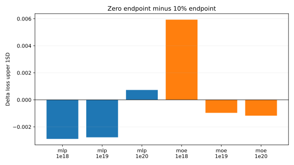
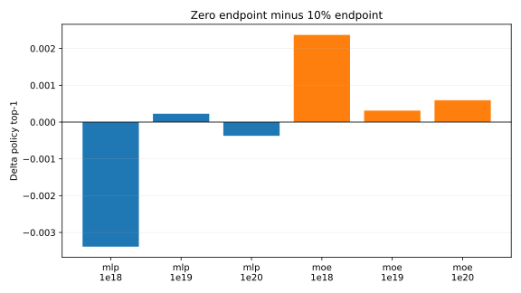

# LR Cooldown To Zero

This follow-up removes the cooldown endpoint multiplier. `lr_cooldown_frac = 0.1` now means a linear decay to zero over the final 10% of steps.

The table compares the zero endpoint against the previous 10% endpoint runs. Selection still uses `loss_upper_1sd = loss/task[ema=0.99] + std(loss/task[ema=0.99])`; MoE runs still require zero dead experts.

## Results

| Family | Budget | 10% endpoint upper 1SD | Zero endpoint upper 1SD | Delta | 10% endpoint top-1 | Zero endpoint top-1 | Dead experts | W&B |
| --- | --- | ---: | ---: | ---: | ---: | ---: | ---: | --- |
| MLP | `1e18` | 3.7613 | 3.7584 | -0.0029 | 0.2885 | 0.2851 |  | [run](https://wandb.ai/maxence-frenette/chess-engine-4/runs/s6qsd9ba) |
| MLP | `1e19` | 3.4976 | 3.4948 | -0.0028 | 0.3481 | 0.3483 |  | [run](https://wandb.ai/maxence-frenette/chess-engine-4/runs/qs2wwwit) |
| MLP | `1e20` | 3.2510 | 3.2518 | +0.0007 | 0.4047 | 0.4044 |  | [run](https://wandb.ai/maxence-frenette/chess-engine-4/runs/reaoy7um) |
| MoE16a2 | `1e18` | 3.7557 | 3.7617 | +0.0059 | 0.3004 | 0.3027 | 0 | [run](https://wandb.ai/maxence-frenette/chess-engine-4/runs/qsn9u7gu) |
| MoE16a2 | `1e19` | 3.4899 | 3.4889 | -0.0010 | 0.3563 | 0.3566 | 0 | [run](https://wandb.ai/maxence-frenette/chess-engine-4/runs/a944s3rf) |
| MoE16a2 | `1e20` | 3.2205 | 3.2194 | -0.0012 | 0.4211 | 0.4216 | 0 | [run](https://wandb.ai/maxence-frenette/chess-engine-4/runs/ha5zww3v) |

## Takeaways

Zero endpoint is close to the 10% endpoint overall. It improves four of six `loss_upper_1sd` values, slightly regresses dense MLP `1e20`, and more noticeably regresses MoE `1e18`. The simplicity win is worth it: there is no longer a second endpoint hyperparameter to choose.

All three MoE zero-endpoint runs ended with zero dead experts.

## Commands

The exact commands are listed in [commands.txt](commands.txt). Full metrics are in [results.csv](results.csv).
