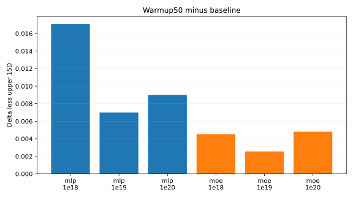
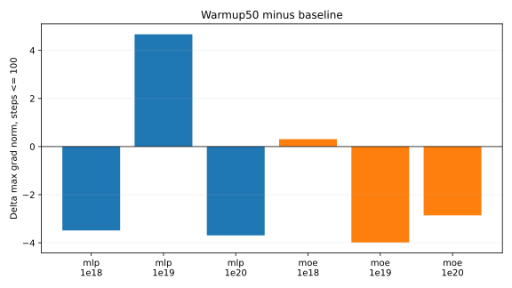

# LR Warmup

This experiment tested `lr_warmup_steps = 50` on top of the current baseline schedule, which already uses `lr_cooldown_frac = 0.1` to decay to zero. The warmup is linear: step 1 uses `1/50` of peak LR and step 50 reaches peak LR.

The main question was whether warmup improves final `loss_upper_1sd` or at least reduces the early grad-norm spike.

## Results

| Family | Budget | Baseline upper 1SD | Warmup upper 1SD | Delta | Baseline top-1 | Warmup top-1 | Baseline max grad <=100 | Warmup max grad <=100 | Dead experts | W&B |
| --- | --- | ---: | ---: | ---: | ---: | ---: | ---: | ---: | ---: | --- |
| MLP | `1e18` | 3.7584 | 3.7755 | +0.0171 | 0.2851 | 0.2875 | 22.24 | 18.75 |  | [run](https://wandb.ai/maxence-frenette/chess-engine-4/runs/onjitoud) |
| MLP | `1e19` | 3.4948 | 3.5018 | +0.0070 | 0.3483 | 0.3474 | 13.50 | 18.17 |  | [run](https://wandb.ai/maxence-frenette/chess-engine-4/runs/o7hzg3n1) |
| MLP | `1e20` | 3.2518 | 3.2608 | +0.0090 | 0.4044 | 0.4025 | 20.95 | 17.26 |  | [run](https://wandb.ai/maxence-frenette/chess-engine-4/runs/lnyqwd6r) |
| MoE16a2 | `1e18` | 3.7617 | 3.7662 | +0.0045 | 0.3027 | 0.3048 | 22.07 | 22.38 | 0 | [run](https://wandb.ai/maxence-frenette/chess-engine-4/runs/451038r5) |
| MoE16a2 | `1e19` | 3.4889 | 3.4915 | +0.0026 | 0.3566 | 0.3557 | 12.95 | 8.97 | 0 | [run](https://wandb.ai/maxence-frenette/chess-engine-4/runs/utybq0rx) |
| MoE16a2 | `1e20` | 3.2194 | 3.2242 | +0.0048 | 0.4216 | 0.4189 | 25.33 | 22.47 | 0 | [run](https://wandb.ai/maxence-frenette/chess-engine-4/runs/j2yz03ye) |

## Takeaways

Warmup50 did not improve the final selection metric on any of the six baselines. It also did not reliably remove the early grad-norm spike. This makes sense in hindsight: the first logged grad norm is measured after backward on the initial model, before the first optimizer step, so lowering the first-step LR cannot affect that first gradient.

It did reduce the max early grad norm on three runs, but increased it on the other three. Since the final metric regressed everywhere, this should not become part of the baseline recipe.

## Commands

The exact commands are listed in [commands.txt](commands.txt). Full metrics are in [results.csv](results.csv).

## warmup50-mlp-1e20 grad norm spike analysis

Link: https://wandb.ai/maxence-frenette/chess-engine-4/runs/lnyqwd6r

The grad norm spikes at step 2980. The losses all spike at step 2990. The grad norm spikes before the loss which means that the spike is likely not caused by bad data, but rather by something bad with the model.
