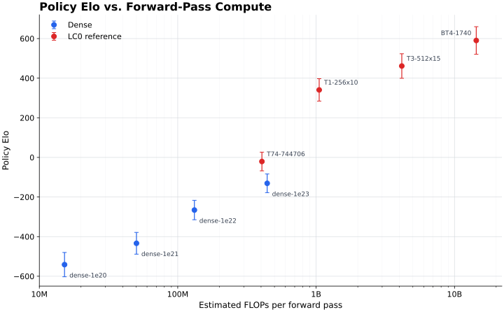
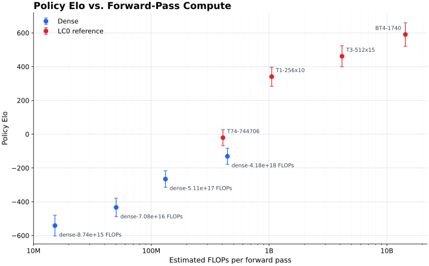

# Policy Elo Round Robin

## Goal

Establish the complete evaluation workflow with the cheapest useful metric:
raw policy-argmax play. This validates parallel Modal orchestration, paired
openings, result aggregation, global Elo fitting, and uncertainty reporting
before running searched matches.

## Protocol

| Item | Value |
| --- | ---: |
| Engines | 8 |
| Matchups | 28 |
| Games per matchup | 64 |
| Total games | 1,792 |
| Mirrored opening pairs per matchup | 32 |
| Effective policy batch | 32 |
| Modal concurrency | 8 L4 jobs |
| Aggregate GPU time | 486.1 seconds |
| Estimated GPU cost | $0.11 |

Lc0 policy mode directly plays the highest-policy legal move. It does not run
MCTS or use the value head, so these ratings measure raw policy play rather
than engine strength. The fixed batch of 32 is part of the protocol because
policy argmax can change with floating-point batching details.

## Results

| Rank | Engine | Elo | 95% CI |
| ---: | --- | ---: | ---: |
| 1 | BT4-1740 | +590.3 | +/-69.5 |
| 2 | T3-512x15 | +461.4 | +/-61.9 |
| 3 | T1-256x10 | +340.7 | +/-56.6 |
| 4 | T74-744706 | -20.7 | +/-47.0 |
| 5 | dense-1e23 | -130.9 | +/-47.2 |
| 6 | dense-1e22 | -265.8 | +/-49.0 |
| 7 | dense-1e21 | -433.7 | +/-54.8 |
| 8 | dense-1e20 | -541.4 | +/-61.3 |

The four dense models are strictly ordered by training compute. Their fitted
policy scaling law improves by **139.9 Elo per compute decade**.

A second complete run changed individual ratings by at most about 21 Elo and
changed the dense slope by only 0.7 Elo per decade. Those shifts are well
inside the fitted confidence intervals.

## Elo by Inference Compute



The same chart with dense models named by actual training FLOPs instead of
step-adjusted compute budget:



| Engine | Estimated FLOPs / forward pass |
| --- | ---: |
| dense-1e20 | 15.2M |
| dense-1e21 | 50.3M |
| dense-1e22 | 131.9M |
| T74-744706 | 405.8M |
| dense-1e23 | 442.9M |
| T1-256x10 | 1.05B |
| T3-512x15 | 4.16B |
| BT4-1740 | 14.36B |

These are architecture-derived estimates with one multiply-add counted as two
FLOPs. Dense-model estimates include the input projection, every SwiGLU matrix
multiplication, and the policy, value, and moves-left heads. Transformer
estimates include the input projection and, per encoder, QKV/output projections,
attention matrix multiplications, and the feed-forward network. The T74 estimate
includes its input convolution, 10 two-convolution residual blocks, and policy
convolution. Small normalization, activation, SE, positional-embedding, and
head overheads are omitted, so the values should be read as comparable forward
compute estimates rather than hardware-profiler measurements. The exact plotted
values are recorded in `forward-flops.json`.

## Command

```bash
uv run eval-roundrobin-modal \
  --config configs/eval/policy-elo.toml \
  --output experiments/2026-07-12.04-policy-elo-round-robin/results.json
```

The JSON result contains the resolved tournament settings, engine artifact
paths, all matchup W/D/L counts and runtimes, fitted ratings, confidence
intervals, and the dense compute scaling fit.

## Infrastructure Finding

Lc0 v0.32.1 corrupted the process heap when two ONNX networks were loaded for
a dense-vs-dense matchup. The evaluator is now pinned to lc0 commit
`d8ce48258c39d331c119f8c8729374ceb3df8409`, which includes ONNX memory,
locking, and multiplay fixes. The previously failing matchup and the complete
tournament both pass with that revision.
