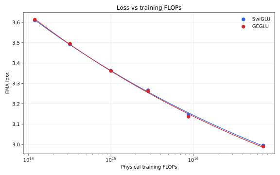

# GEGLU Activation Evaluation

## Decision

The activation comparison is inconclusive. GEGLU loses at the two smallest
widths and wins from `d128` through `d576`, but the larger-scale loss differences
are comparable to the limited inter-run variance evidence. The live model family
and canonical best runs therefore remain on SwiGLU, the established default used
by most comparable open-weight language models.

Every live TOML recipe explicitly selects SwiGLU. The model config also retains
SwiGLU as the implicit value for loading historical checkpoints whose serialized
config predates the activation field.

## Matched GEGLU Runs

| Width | Depth | Modified compute | Loss | Loss + 1 SD | Policy top-1 | FLOPs efficiency | Gain vs SwiGLU | W&B |
| ---: | ---: | ---: | ---: | ---: | ---: | ---: | ---: | --- |
| 64 | 3 | 1.002e18 | 3.6131 | 3.7302 | 29.62% | 1.005x | -2.6% | [run](https://wandb.ai/maxence-frenette/chess-engine-4/runs/cv8h4906) |
| 96 | 4 | 3.007e18 | 3.4950 | 3.5757 | 32.53% | 0.979x | -3.4% | [run](https://wandb.ai/maxence-frenette/chess-engine-4/runs/q6hlm667) |
| 128 | 4 | 1.002e19 | 3.3611 | 3.4230 | 35.83% | 1.022x | +1.4% | [run](https://wandb.ai/maxence-frenette/chess-engine-4/runs/edy5sn69) |
| 192 | 4 | 3.006e19 | 3.2620 | 3.3134 | 38.39% | 0.941x | +4.1% | [run](https://wandb.ai/maxence-frenette/chess-engine-4/runs/vt68azvm) |
| 288 | 5 | 1.002e20 | 3.1363 | 3.1818 | 41.79% | 1.162x | +9.0% | [run](https://wandb.ai/maxence-frenette/chess-engine-4/runs/4g4vkfr7) |
| 576 | 5 | 1.001e21 | 2.9894 | 3.0229 | 46.36% | 0.849x | +7.4% | [run](https://wandb.ai/maxence-frenette/chess-engine-4/runs/4nkrvy7t) |

These runs are retained as experimental evidence, not canonical best runs. The
gain column compares each GEGLU run with its matched SwiGLU predecessor against
the same physical-FLOPs/loss curve, isolating the activation change from whether
that width is globally above or below trend.

## Loss Scaling

The points are matched observed runs. Each line is fitted independently using
the repository's loss power-law model.

The `d576` follow-up improved over the canonical SwiGLU predecessor on loss
(2.9950 to 2.9894), loss plus one standard deviation (3.0283 to 3.0229), and
policy top-1 (46.29% to 46.36%). However, another matching SwiGLU run reached
2.9920 loss, and the 0.0030 spread between the two SwiGLU repeats is comparable
to GEGLU's advantage at this width.

## Conclusion

The activation comparison is inconclusive. Available SwiGLU repeats suggest
inter-run EMA-loss variation of roughly 0.001 to 0.003. The `d288` GEGLU gain is
larger than that observed variation, but the `d576` gain is not, and every
activation-width pair has only one GEGLU run. The project therefore retains
SwiGLU as the canonical activation. GEGLU remains available as a model-config
option for future experiments.

## Changes

- All dense TOML configs explicitly use `activation = "swiglu"`.
- Canonical best runs use SwiGLU at every retained width.
- The old `d128x2` recipe was removed rather than rerun or retained.
- The `3e18` point uses the matched `d96x4` SwiGLU run.
- Future generated configs default explicitly to SwiGLU.
