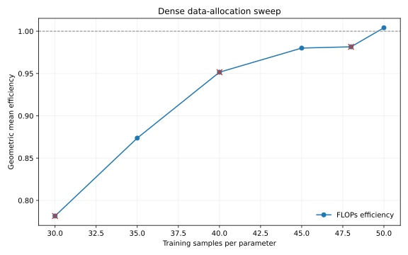

# Dense Data-to-Parameter Ratio

## Goal

Replace the independent step scaling law with one constant number of training
samples per total model parameter. Steps are now resolved as:

```text
steps = round(samples_per_parameter * total_parameters / batch_size)
```

The model shape, batch size, learning rate, optimizer, loss, and precision follow
the canonical dense recipe. All widths ran concurrently where Modal capacity
allowed. Three transient Rust loader timeouts were rerun unchanged.

## Aggregate Results

The table reports the geometric mean efficiency across `d32`, `d64`, `d128`, and
`d256`. A ratio is invalid when any width detected a loss spike.

| Samples / parameter | FLOPs efficiency | Invalid widths |
| ---: | ---: | ---: |
| 30 | 0.782x | 1 |
| 35 | 0.874x | 0 |
| 40 | 0.952x | 1 |
| 45 | 0.980x | 0 |
| 48 | 0.982x | 1 |
| **50** | **1.004x** | **0** |



Ratio 50 has the strongest aggregate FLOPs efficiency and is stable at all four
widths. It becomes the canonical family ratio.

## Selected Runs

| Model | Steps | Loss | Loss + 1 SD | Policy top-1 | W&B |
| --- | ---: | ---: | ---: | ---: | --- |
| `d32x2` | 7,776 | 3.7877 | 3.9383 | 0.2545 | [run](https://wandb.ai/maxence-frenette/chess-engine-4/runs/yi6fauit) |
| `d64x3` | 8,953 | 3.5770 | 3.6659 | 0.3039 | [run](https://wandb.ai/maxence-frenette/chess-engine-4/runs/mtppahc9) |
| `d128x4` | 11,942 | 3.3467 | 3.4019 | 0.3616 | [run](https://wandb.ai/maxence-frenette/chess-engine-4/runs/j2bqne56) |
| `d256x5` | 19,136 | 3.0970 | 3.1344 | 0.4280 | [run](https://wandb.ai/maxence-frenette/chess-engine-4/runs/0dg5f55u) |

The full per-run metrics and W&B URLs are in `results.csv`.
