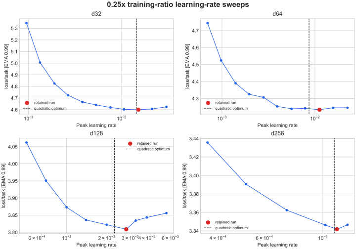

# Dense 0.25x Learning-Rate Fit

## Goal

Establish peak learning rates for deliberately undertrained dense models at
`0.25x` the canonical data allocation. The canonical allocation is 50 samples
per total parameter, so these runs see 12.5 samples per parameter.

Runs used the code based on commit `5c8196b`, the Modal B200 training path, and
the existing Leela T80 data volume. Model shape, batch size, optimizer settings,
and the 10% cooldown were inherited from `configs/dense.py`; only learning rate
and training ratio changed.

## Commands

The initial 20-run sweep used five LR multipliers at all four widths:

```sh
uv run train-modal --config configs/dense.py --d-model 128 --training-ratio 0.25 --lr 0.0014 --wandb-name dense-r025-lr-d128-m140
```

The multiplier grid started at `0.5, 0.7, 1.0, 1.4, 2.0`. Edge extensions
covered up to `16x` at d32/d64, `5.6x` at d128, and `2x` at d256. There were 38
runs in total, launched in parallel with at most ten Modal jobs at once.

## Results



| Width | Fitted LR | Retained LR | Loss | Policy top-1 | EG_flops | W&B |
| --- | ---: | ---: | ---: | ---: | ---: | --- |
| d32 | 0.0145 | 0.0152 | 4.59965 | 18.73% | 0.016x | [dm6xqeek](https://wandb.ai/maxence-frenette/chess-engine-4/runs/dm6xqeek) |
| d64 | 0.00864 | 0.0112 | 4.23407 | 23.02% | 0.031x | [o2ypf3ks](https://wandb.ai/maxence-frenette/chess-engine-4/runs/o2ypf3ks) |
| d128 | 0.00229 | 0.0028 | 3.80883 | 29.24% | 0.092x | [9e7rfwx6](https://wandb.ai/maxence-frenette/chess-engine-4/runs/9e7rfwx6) |
| d256 | 0.00111 | 0.0011315 | 3.34170 | 37.38% | 0.413x | [gibusiw6](https://wandb.ai/maxence-frenette/chess-engine-4/runs/gibusiw6) |

The fitted optimum comes from a local quadratic in loss versus log learning
rate. The retained run is the lowest-loss valid observed run. The d256 `2x` LR
run recorded one loss spike and was excluded.

All four runs are intentionally below the compute-optimal loss/FLOPs trend.
They are retained as best runs for their `(width, 0.25x)` cells with
`frontier = false`, so they do not influence the frontier fit.

## Recipe Fit

The optimal LR multiplier over the 1x recipe falls from about `7.7x` at d32 to
`1.5x` at d256, so the observations do not support a precise shared exponent.
The recipe conservatively anchors its single data-ratio exponent to d256, the
largest and most stability-sensitive model in the sweep:

```text
lr(d, ratio) = lr_1x(d) * ratio^-0.292
0.25^-0.292 = 1.50
```

This leaves the existing width exponent solely responsible for model-size
scaling and makes the multiplier exactly one at `training_ratio = 1`. At
`0.25x`, the recipe uses peak LRs of `0.0029`, `0.0021`, `0.0015`, and `0.0011`
for d32 through d256. These are intentionally conservative for the smaller
models. The exponent should be revisited after measuring another data ratio.
