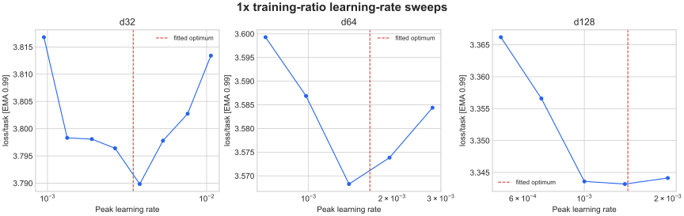
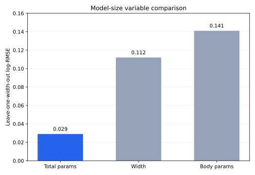
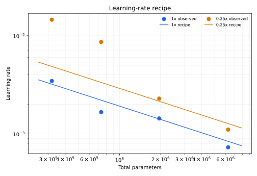

# Dense Learning-Rate Fit

## Goal

Fit one learning-rate recipe across model size and training ratio, then validate
the resulting `1x` recipe by rerunning d32, d64, d128, and d256. All runs used
commit `43a9bdc`, the Modal B200 training path, and the Leela T80 data volume.

## LR Sweeps

The initial `1x` sweep tested LR multipliers `0.5, 0.7, 1.0, 1.4, 2.0` at d32,
d64, and d128. The d32 boundary was extended to `2.8x, 4x, 5.6x`.

```sh
uv run train-modal --config configs/dense.py --d-model 128 --training-ratio 1 --lr 0.0014 --wandb-name dense-r1-lr-d128-m140
```



Local quadratics in loss versus log LR produced the following continuous
optima. The selected recipe is smoother than the individual noisy optima.

| Width | Fitted 1x LR | Recipe LR |
| --- | ---: | ---: |
| d32 | 0.00346 | 0.0032 |
| d64 | 0.00166 | 0.0022 |
| d128 | 0.00143 | 0.0014 |
| d256 | 0.00073 | 0.00084 |

No sweep or validation run recorded a loss spike.

## Model-Size Variable



Total parameters, body parameters, and residual width were compared with a
power law over the final validated `1x` LRs. Total parameters had the lowest
leave-one-width-out log-RMSE at `0.029`, compared with `0.112` for width and
`0.141` for body parameters.

This comparison is partly circular because the validated ladder was smoothed
using the total-parameter law. On the noisier independently fitted sweep optima,
body parameters score `0.210`, width `0.216`, and total parameters `0.238`;
those differences are too small to identify a winner. Total parameters remain
the operational variable because they preserve the validated ladder and avoid
introducing a second parameter-count convention.

## Recipe



The first additive-floor fit was rejected by validation: it underpredicted the
d128 LR and introduced an unsupported asymptotic floor. The retained model-size
law is multiplied by Marin's fixed token-horizon correction:

```text
lr(N, ratio) = 0.96 * N^-0.45 * ratio^-0.3
```

Here `N` is total parameters and `ratio` is relative to the canonical 50
samples per parameter. Because `ratio` is actual data divided by reference data,
Marin's `(T0 / T)^0.3` correction becomes `ratio^-0.3`. The exponent is fixed
from the Marin recipe rather than fitted to these runs. At `0.25x` data, it
multiplies the `1x` LR by `4^0.3 = 1.516`.

## Validation

The fitted recipe was rerun at all four non-stale widths before its coefficients
were rounded for readability. `Incumbent delta` is the change in `EG_flops`
versus the prior same-width best run. `Control delta` compares against a
contemporaneous run at the old LR; it is included because the multithreaded
loader makes data order nondeterministic.

| Width | LR | Loss | Incumbent delta | Control delta | W&B |
| --- | ---: | ---: | ---: | ---: | --- |
| d32 | 0.0031 | 3.77800 | +0.073x | +0.092x | [eubeiyki](https://wandb.ai/maxence-frenette/chess-engine-4/runs/eubeiyki) |
| d64 | 0.0021 | 3.56963 | -0.011x | +0.093x | [cmm3vgac](https://wandb.ai/maxence-frenette/chess-engine-4/runs/cmm3vgac) |
| d128 | 0.0014 | 3.34146 | +0.015x | - | [xabwy2o4](https://wandb.ai/maxence-frenette/chess-engine-4/runs/xabwy2o4) |
| d256 | 0.0008 | 3.09641 | +0.006x | +0.063x | [nj3mat7f](https://wandb.ai/maxence-frenette/chess-engine-4/runs/nj3mat7f) |

The validation settings are within `5%` of the rounded recipe. They improve
three widths. The d64 result is `1.1%` behind an unusually
strong historical incumbent but `9.3%` ahead of its fresh old-LR control, so it
is treated as no material regression. These four runs replace the old d32-d256
entries and validate the fitted recipe to the precision supported by the LR
sweeps.
