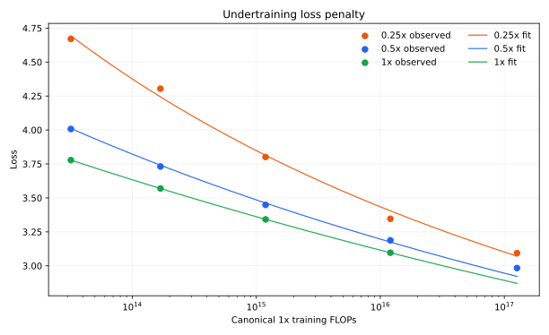
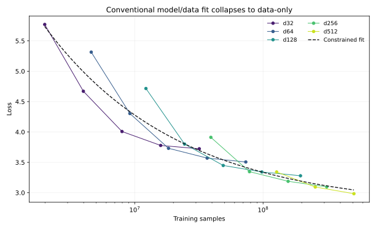
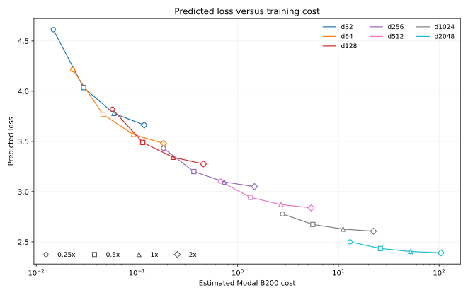

# Dense Model/Data Allocation

## Goal

Measure how dense-model loss changes with model size and data allocation, then
test whether the results identify a conventional model/data scaling law:

```text
L(N, D) = E + A * N^-alpha + B * D^-beta
```

The experiment used one canonical LR recipe across the following grid:

- `0.125x` data from d32 through d512.
- `0.25x` and `0.5x` data from d32 through d512.
- Existing `1x` baselines from d32 through d256.
- `2x` data from d32 through d128.

The 18 new runs launched concurrently in two waves on Modal B200s. Their summed
GPU runtime was 2,542 seconds, approximately `$4.41` at `$6.25/hour`.

## Results

| Width | Ratio | Samples | Steps | LR | Loss | Policy top-1 | Spikes | W&B |
| --- | ---: | ---: | ---: | ---: | ---: | ---: | ---: | --- |
| d32 | 0.125x | 1,990,656 | 972 | 0.0060 | 5.7702 | 12.77% | 0 | [run](https://wandb.ai/maxence-frenette/chess-engine-4/runs/8nlxb2mz) |
| d32 | 0.25x | 3,981,312 | 1,944 | 0.0049 | 4.6703 | 18.02% | 0 | [run](https://wandb.ai/maxence-frenette/chess-engine-4/runs/idopsso7) |
| d32 | 0.5x | 7,962,624 | 3,888 | 0.0039 | 4.0073 | 23.08% | 0 | [run](https://wandb.ai/maxence-frenette/chess-engine-4/runs/cyupzlq2) |
| d32 | 2x | 31,850,496 | 15,552 | 0.0026 | 3.7231 | 26.59% | 0 | [run](https://wandb.ai/maxence-frenette/chess-engine-4/runs/mnlo3774) |
| d64 | 0.125x | 4,583,424 | 1,119 | 0.0041 | 5.3149 | 16.31% | 0 | [run](https://wandb.ai/maxence-frenette/chess-engine-4/runs/hcq9adjs) |
| d64 | 0.25x | 9,166,848 | 2,238 | 0.0033 | 4.3041 | 22.74% | 0 | [run](https://wandb.ai/maxence-frenette/chess-engine-4/runs/udz5pkl7) |
| d64 | 0.5x | 18,333,696 | 4,476 | 0.0027 | 3.7311 | 28.18% | 0 | [run](https://wandb.ai/maxence-frenette/chess-engine-4/runs/asoo4jxp) |
| d64 | 2x | 73,338,880 | 17,905 | 0.0018 | 3.5061 | 32.01% | 0 | [run](https://wandb.ai/maxence-frenette/chess-engine-4/runs/bxek43jn) |
| d128 | 0.125x | 12,230,656 | 1,493 | 0.0026 | 4.7157 | 21.81% | 0 | [run](https://wandb.ai/maxence-frenette/chess-engine-4/runs/injasnnq) |
| d128 | 0.25x | 24,453,120 | 2,985 | 0.0021 | 3.8011 | 29.56% | 0 | [run](https://wandb.ai/maxence-frenette/chess-engine-4/runs/qsp3f2m0) |
| d128 | 0.5x | 48,914,432 | 5,971 | 0.0017 | 3.4485 | 34.09% | 0 | [run](https://wandb.ai/maxence-frenette/chess-engine-4/runs/hxi5cbgg) |
| d128 | 2x | 195,649,536 | 23,883 | 0.0012 | 3.2789 | 37.79% | 0 | [run](https://wandb.ai/maxence-frenette/chess-engine-4/runs/kwf25c2k) |
| d256 | 0.125x | 39,190,528 | 2,392 | 0.0016 | 3.9118 | 30.38% | 0 | [run](https://wandb.ai/maxence-frenette/chess-engine-4/runs/nz5u5ivx) |
| d256 | 0.25x | 78,381,056 | 4,784 | 0.0013 | 3.3461 | 37.08% | 0 | [run](https://wandb.ai/maxence-frenette/chess-engine-4/runs/fyxlkzlc) |
| d256 | 0.5x | 156,762,112 | 9,568 | 0.0010 | 3.1878 | 40.69% | 0 | [run](https://wandb.ai/maxence-frenette/chess-engine-4/runs/sbxr4p7e) |
| d512 | 0.125x | 127,533,056 | 3,892 | 0.00092 | 3.3415 | 38.56% | 1 | [run](https://wandb.ai/maxence-frenette/chess-engine-4/runs/91qksein) |
| d512 | 0.25x | 255,033,344 | 7,783 | 0.00075 | 3.0934 | 43.47% | 1 | [run](https://wandb.ai/maxence-frenette/chess-engine-4/runs/duwcy9d9) |
| d512 | 0.5x | 510,099,456 | 15,567 | 0.00061 | 2.9836 | 46.38% | 1 | [run](https://wandb.ai/maxence-frenette/chess-engine-4/runs/roresfc4) |

The three d512 runs are accepted despite one detected spike each. These
exceptions are recorded as comments in `results.toml` and the canonical
best-runs TOML.

## Initial Ratio Fit

The first wave covered `0.25x` and `0.5x`. A conventional free model/data law
already collapsed its model-size term to zero, so the provisional fit anchored
the established `1x` loss/FLOPs curve and estimated the data-ratio penalty:

```text
L(C1, r) = L1(C1) + 0.0642 * (C1 / 1e15)^-0.1834 * (r^-1.5505 - 1)
```

Its penalty RMSE was `0.0354`, and d512 holdout RMSE was `0.0538` before d512
was included in the fit.



## Expanded Model/Data Fit

The `0.125x` and `2x` wave added overlapping absolute sample counts and brought
the grid to 22 observations including the existing `1x` baselines. It still
does not identify a conventional positive model/data law. Using
`N6 = N / 1e6` and `D8 = D / 1e8`, the constrained optimum is:

```text
L(N, D) = 2.7424 + 0 * N6^-alpha + 0.5933 * D8^-0.4133
```

The model coefficient again lands at zero, with `0.2164` RMSE. Allowing it to
become negative lowers RMSE to `0.1719`, which is not a physically useful
scaling law but is diagnostic: under this recipe, larger models can perform
worse at fixed data.



## Step-Count Confound

The overlapping sample counts reveal why the conventional law fails:

| Comparison | Samples | Steps | Loss |
| --- | ---: | ---: | ---: |
| d32 at 1x | 15.9M | 7,776 | 3.7780 |
| d128 at 0.125x | 12.2M | 1,493 | 4.7157 |
| d64 at 1x | 36.7M | 8,953 | 3.5696 |
| d256 at 0.125x | 39.2M | 2,392 | 3.9118 |
| d128 at 1x | 97.8M | 11,942 | 3.3415 |
| d512 at 0.125x | 127.5M | 3,892 | 3.3415 |

The `64d` batch recipe gives larger undertrained models far fewer optimizer
steps at similar data counts. Loss is therefore not a function of model size
and data alone. The next recipe should reduce batch size enough that low-ratio
models leave this optimization-starved regime; `B(d) = 16d` is the proposed
starting point.

The expanded ratio-aware anchored fit remains more descriptive than the
conventional law, but its RMSE worsens to `0.0736`. It should not be treated as
a universal model/data law.

## Cost Projection



Costs use the measured `throughput-dense.toml` runtimes for the current `64d`
batch recipe and Modal's `$6.25/hour` B200 price. Predictions use the expanded
ratio-aware fit, so this chart must be regenerated after changing the batch
recipe.

## Command Patterns

```sh
uv run train-modal --config configs/dense.py --d-model 128 --training-ratio 0.5 --wandb-name dense-undertraining-law-d128-r0.5
uv run train-modal --config configs/dense.py --d-model 256 --training-ratio 0.125 --wandb-name dense-lnd-d256-r0.125
```
