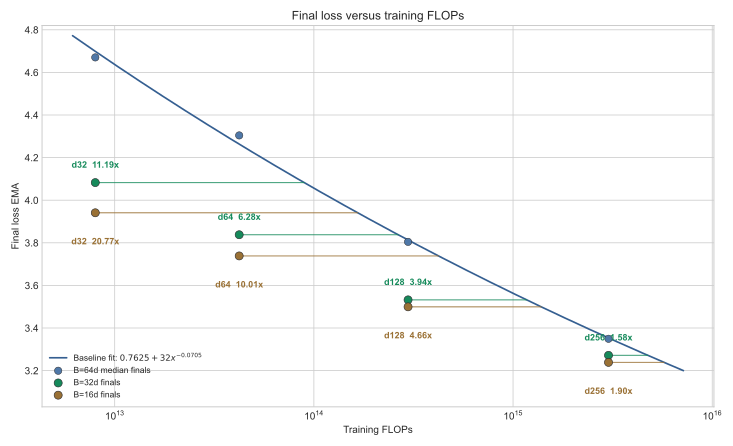
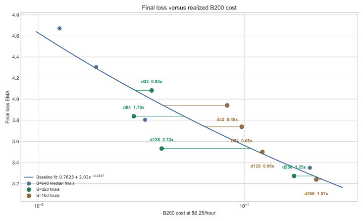

# Dense Reduced-Batch Cost Sweep

## Goal

Test whether undertrained larger models can use more training FLOPs but less
actual B200 time than the preceding `1x` model. The reduced-batch recipe uses:

```text
training_ratio = 0.25
batch_size = 16 * d_model
lr = 0.5 * previous_0.25x_lr
```

Relative to the previous `0.25x` recipe, this holds samples and model FLOPs
fixed, reduces batch size by four, and increases optimizer steps by four. The LR
adjustment was extrapolated from the successful d128 pilot rather than tuned at
each width.

## Full-Run Results

| Recipe | Width | Batch | Steps | LR | Loss | Policy top-1 | Runtime | Global EG_flops | Spikes | W&B |
| --- | --- | ---: | ---: | ---: | ---: | ---: | ---: | ---: | ---: | --- |
| B=32d | d32 | 1,024 | 3,888 | 0.0035 | 4.0826 | 21.32% | 20.41s | 0.432x | 0 | [run](https://wandb.ai/maxence-frenette/chess-engine-4/runs/lx00nl9m) |
| B=32d | d64 | 2,048 | 4,476 | 0.0023 | 3.8378 | 26.33% | 16.70s | 0.482x | 0 | [run](https://wandb.ai/maxence-frenette/chess-engine-4/runs/mfpnkfkk) |
| B=32d | d128 | 4,096 | 5,970 | 0.0015 | 3.5322 | 32.23% | 22.83s | 0.771x | 0 | [run](https://wandb.ai/maxence-frenette/chess-engine-4/runs/c07jz8dg) |
| B=32d | d256 | 8,192 | 9,568 | 0.00092 | 3.2717 | 38.70% | 100.76s | 0.747x | 0 | [run](https://wandb.ai/maxence-frenette/chess-engine-4/runs/kdvdauha) |
| B=16d | d32 | 512 | 7,776 | 0.0024 | 3.9409 | 22.46% | 47.63s | **1.186x** | 0 | [run](https://wandb.ai/maxence-frenette/chess-engine-4/runs/3m2gesku) |
| B=16d | d64 | 1,024 | 8,953 | 0.0017 | 3.7384 | 27.94% | 56.00s | **1.031x** | 0 | [run](https://wandb.ai/maxence-frenette/chess-engine-4/runs/qs2fdl2p) |
| B=16d | d128 | 2,048 | 11,940 | 0.0010 | 3.4995 | 33.12% | 70.64s | **1.015x** | 0 | [run](https://wandb.ai/maxence-frenette/chess-engine-4/runs/7p5dq35u) |
| B=16d | d256 | 4,096 | 19,136 | 0.00065 | 3.2386 | 39.20% | 129.25s | **1.016x** | 0 | [run](https://wandb.ai/maxence-frenette/chess-engine-4/runs/ieip6giz) |

## Efficiency Curves

These charts compare final checkpoints only. The blue points fit the old
`B=64d` undertrained recipe; green points show `B=32d`, and brown points show
`B=16d`. The loss floor is fixed to `0.7625`, matching the current canonical
loss/FLOPs fit. Horizontal segments connect each candidate to the baseline
resource required to reach the same fitted loss.



The annotations are fit-relative gains over the old undertrained recipe, not
the project-wide `EG_flops` shown in the results table. Both smaller-batch
recipes improve loss at fixed FLOPs. `B=16d` is consistently more FLOP-efficient
than `B=32d`; at d256 their gains are `1.90x` and `1.58x`, respectively.



The annotations on the cost chart are `EG_realized`: fitted baseline dollars
required for the candidate loss divided by actual candidate dollars. `B=32d`
is the better realized-cost compromise in this cohort, reaching `1.76x`,
`2.72x`, and `1.25x` from d64 through d256. Its four runs cost `$0.279` total.

All four runs beat the established loss/FLOPs trend, and none had a detected
loss spike. This is a clean optimization-efficiency result: the extra steps
eliminate the low-ratio optimization deficit without increasing model FLOPs.

Against the old `B=64d` runs at the same width and data allocation, both new
recipes lower loss everywhere. `B=32d` retains more of the baseline's hardware
efficiency while recovering much of the optimization benefit of extra steps.

| Width | B=64d loss / runtime | B=32d loss / runtime | B=16d loss / runtime |
| --- | ---: | ---: | ---: |
| d32 | 4.6703 / 7.26s | 4.0826 / 20.41s | **3.9409** / 47.63s |
| d64 | 4.3041 / 10.96s | 3.8378 / **16.70s** | **3.7384** / 56.00s |
| d128 | 3.8044 / 18.96s | 3.5322 / **22.83s** | **3.4995** / 70.64s |
| d256 | 3.3494 / 120.26s | 3.2717 / **100.76s** | **3.2386** / 129.25s |

## Runtime Replication

The old baseline runtimes were suspicious, so each width was measured three
times and the cost fit uses the median. Loss is effectively reproducible, but
runtime is not:

| Width | Runtime observations | Median | Range / median |
| --- | --- | ---: | ---: |
| d32 | 7.21s, 7.26s, 16.41s | 7.26s | 1.27x |
| d64 | 9.90s, 10.96s, 16.65s | 10.96s | 0.62x |
| d128 | 18.84s, 18.96s, 41.57s | 18.96s | 1.20x |
| d256 | 52.27s, 120.26s, 145.21s | 120.26s | 0.77x |

The d256 spread is especially large. Its two fresh replicas detected one loss
spike each, while the original run was spike-free; their final EMA losses still
agree within `0.0054`. Median runtime reduces sensitivity to one anomalous run,
but candidate replication would be required to resolve a small realized gain.

## Decision

`B=32d` is the stronger compromise in this experiment. It gives up some of the
FLOP-efficiency improvement of `B=16d`, but is substantially cheaper in measured
B200 time and is nominally above the old recipe's dollar frontier from d64
upward. The d256 result is especially practical: lower loss and lower runtime
than the median `B=64d` baseline.

Runtime variance remains large enough that the dollar multipliers should not be
treated as precise. Based on the consistent loss improvement and better balance
between FLOP efficiency and realized cost, `B=32d` is the canonical dense batch
size from this experiment onward.

## Commands

```sh
uv run train-modal --config configs/dense.py --d-model 32 --training-ratio 0.25 --batch-size 512 --steps 7776 --lr 0.0024 --wandb-name dense-b16d-r025-d32-lr24
uv run train-modal --config configs/dense.py --d-model 64 --training-ratio 0.25 --batch-size 1024 --steps 8953 --lr 0.0017 --wandb-name dense-b16d-r025-d64-lr17
uv run train-modal --config configs/dense.py --d-model 128 --training-ratio 0.25 --batch-size 2048 --steps 11940 --lr 0.001 --wandb-name dense-batch-cost-d128-b2048-lr10
uv run train-modal --config configs/dense.py --d-model 256 --training-ratio 0.25 --batch-size 4096 --steps 19136 --lr 0.00065 --wandb-name dense-b16d-r025-d256-lr065
uv run train-modal --config configs/dense.py --d-model 128 --training-ratio 0.25 --batch-size 4096 --steps 5970 --lr 0.0015 --wandb-name dense-b32d-r025-d128-lr15
```
