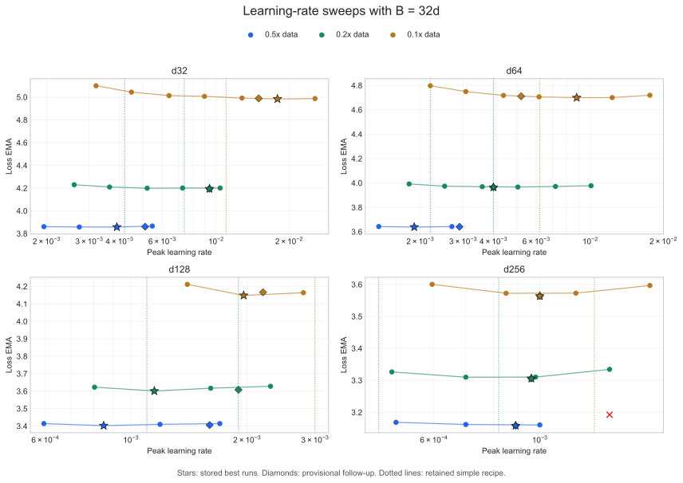

# Dense Learning Rate by Training Ratio

## Goal

Retune the dense learning-rate recipe after changing the canonical batch size
from `64d` to `32d`. The sweep covers d32, d64, d128, and d256 at `0.5x`,
`0.2x`, and `0.1x` the canonical 50-samples-per-parameter horizon.

## Method

The initial grid tested `0.5x`, `0.7x`, and `1.0x` the previous LR prediction
in every width/ratio cell. Cells whose best result landed on an edge were
extended to `0.35x` or as high as `4x`. A 12-run follow-up sampled a provisional
fit inside every cell; those runs are additional observations in the final fit.
Two candidate laws were then compared at held-out 1x horizons using two
replicates each at d32 and d64. In total, 75 runs completed on Modal B200s with
ten-way concurrency. Their summed GPU runtime was 3,756 seconds, approximately
`$6.52` at `$6.25/hour`.

Selection uses `loss/task[ema=0.99]`. All selected runs had zero detected loss
spikes. The undertrained grid is in `results.csv`; the held-out comparison is
in `heldout.csv`.



## Selected Runs

| Ratio | Width | Best observed LR | Recipe LR | Loss | Policy top-1 | W&B |
| ---: | --- | ---: | ---: | ---: | ---: | --- |
| 0.5x | d32 | 0.0039 | 0.0042 | 3.8571 | 24.54% | [run](https://wandb.ai/maxence-frenette/chess-engine-4/runs/jrp2q8at) |
| 0.5x | d64 | 0.00189 | 0.0022 | 3.6388 | 29.18% | [run](https://wandb.ai/maxence-frenette/chess-engine-4/runs/6gc3d7y4) |
| 0.5x | d128 | 0.00085 | 0.0011 | 3.4024 | 34.86% | [run](https://wandb.ai/maxence-frenette/chess-engine-4/runs/b073bx38) |
| 0.5x | d256 | 0.00089 | 0.00046 | 3.1582 | 41.35% | [run](https://wandb.ai/maxence-frenette/chess-engine-4/runs/ww1di2gn) |
| 0.2x | d32 | 0.0094 | 0.0074 | 4.1939 | 20.06% | [run](https://wandb.ai/maxence-frenette/chess-engine-4/runs/05b859l9) |
| 0.2x | d64 | 0.0040 | 0.0040 | 3.9647 | 24.98% | [run](https://wandb.ai/maxence-frenette/chess-engine-4/runs/l3lwxdvw) |
| 0.2x | d128 | 0.00115 | 0.0019 | 3.6008 | 31.07% | [run](https://wandb.ai/maxence-frenette/chess-engine-4/runs/x8xk6wj9) |
| 0.2x | d256 | 0.00096 | 0.00082 | 3.3058 | 37.45% | [run](https://wandb.ai/maxence-frenette/chess-engine-4/runs/tlkib3fr) |
| 0.1x | d32 | 0.01792 | 0.011 | 4.9836 | 15.07% | [run](https://wandb.ai/maxence-frenette/chess-engine-4/runs/418gqsdy) |
| 0.1x | d64 | 0.0088 | 0.0062 | 4.6991 | 18.71% | [run](https://wandb.ai/maxence-frenette/chess-engine-4/runs/amf11yb7) |
| 0.1x | d128 | 0.00196 | 0.0030 | 4.1482 | 25.03% | [run](https://wandb.ai/maxence-frenette/chess-engine-4/runs/f6z8w9e2) |
| 0.1x | d256 | 0.0010 | 0.0013 | 3.5636 | 33.06% | [run](https://wandb.ai/maxence-frenette/chess-engine-4/runs/55gubwxk) |

The narrow models need a much stronger LR increase as their training horizon
shrinks. At `0.1x`, the d32 and d64 optima are roughly `5.6x` and `4x` their
1x recipe values, while d256 remains close to its 1x value. A single fixed
training-ratio exponent cannot represent this pattern.

## Candidate Fits

Repeated runs at the same LR are averaged, then a quadratic in log LR estimates
the optimum in each width/ratio cell. Both candidate laws are fitted only to
these 12 undertrained optima. The simple separable fit is:

```text
lr(N, ratio) = 31.75 * N^-0.74 * ratio^-0.63
```

The richer fit lets the ratio exponent decay with parameter count:

```text
gamma(N) = 0.65 * (N / 1e6)^-0.46
lr(N, ratio) = 0.087 * N^-0.32 * ratio^-gamma(N)
```

The simple law has `0.314` log-LR RMSE on the fitted optima; gamma lowers it to
`0.187`. Interpolating the measured loss curves gives mean loss regret of
`0.0071` for simple and `0.0045` for gamma. Gamma is clearly the better
in-sample description, but that comparison alone does not establish better
extrapolation.

## Held-Out Selection

The laws predict substantially different rates at 1x for the two cheapest
widths. Each prediction was run twice with B=32d:

| Width | Law | LR | Mean loss | Policy top-1 | Replicates |
| --- | --- | ---: | ---: | ---: | --- |
| d32 | Simple | 0.002741 | **3.77191** | 25.95% | [1](https://wandb.ai/maxence-frenette/chess-engine-4/runs/ppp6ody1), [2](https://wandb.ai/maxence-frenette/chess-engine-4/runs/lk022zc7) |
| d32 | Gamma | 0.001469 | 3.77286 | 25.97% | [1](https://wandb.ai/maxence-frenette/chess-engine-4/runs/r1cwgaa7), [2](https://wandb.ai/maxence-frenette/chess-engine-4/runs/nrc9b4u6) |
| d64 | Simple | 0.001480 | **3.55368** | **31.18%** | [1](https://wandb.ai/maxence-frenette/chess-engine-4/runs/k0m2hvdi), [2](https://wandb.ai/maxence-frenette/chess-engine-4/runs/xpe6ee6q) |
| d64 | Gamma | 0.001123 | 3.55569 | 31.11% | [1](https://wandb.ai/maxence-frenette/chess-engine-4/runs/b5ovs775), [2](https://wandb.ai/maxence-frenette/chess-engine-4/runs/44r3tglr) |

Simple wins both held-out cells, by `0.00095` loss at d32 and `0.00202` at d64.
The margins are small, but the ordering is consistent across widths and
replicates. Because simple also uses one fewer fitted parameter, it is the
retained recipe.

No historical 1x learning rates are used. The implied 1x values are therefore
extrapolations from the `0.1x` to `0.5x` fit. The d32 and d64 predictions are
now held-out validated; d128 and d256 remain extrapolations.

The best observed runs replace the previous `0.5x` entries and establish new
non-frontier `0.1x` and `0.2x` entries in `best-runs-dense.toml`.

## Command Pattern

```sh
uv run train-modal --config configs/dense.py --d-model 128 --training-ratio 0.2 --lr 0.00115 --wandb-name dense-lr32d-r0p2-d128-m050
```
