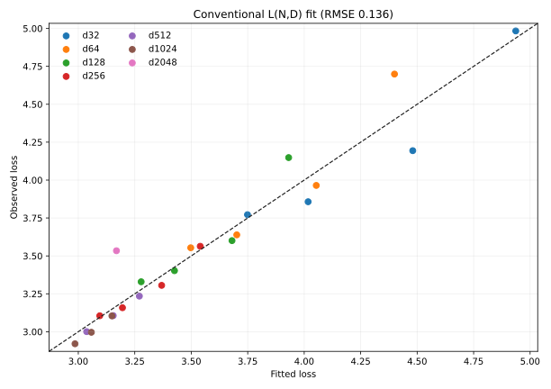
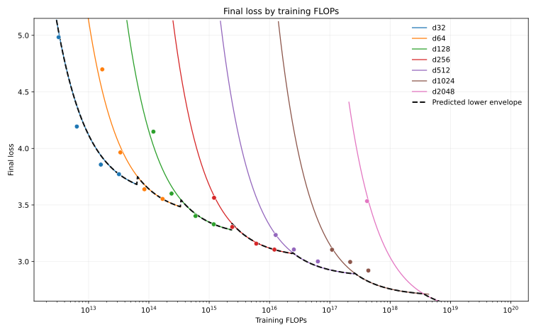
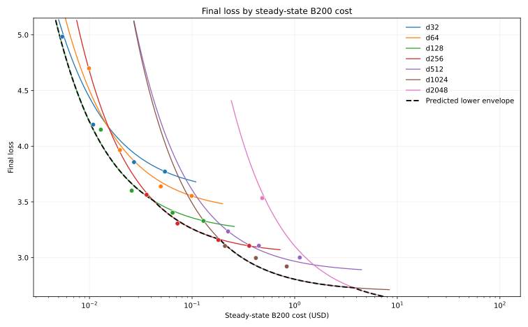

# Dense Model/Data and Dollar Allocation

## Goal

Repeat the model/data scaling experiment under the current `B=32d` recipe and
estimate which degree of undertraining minimizes B200 cost for a target final
loss. The experiment reuses the selected d32-d256 observations at `0.1x`,
`0.2x`, `0.5x`, and the available `1x` anchors, then adds nine runs chosen to
overlap absolute dataset sizes across larger models.

All new runs used commit `d6d6eb8`, the canonical learning-rate recipe, and the
existing B200 throughput measurements. All nine completed with zero detected
loss spikes.

## Added Runs

| Width | Ratio | Steps | LR | Loss | Policy top-1 | W&B |
| --- | ---: | ---: | ---: | ---: | ---: | --- |
| d128 | 1x | 23,883 | 0.0007 | 3.3294 | 36.61% | [run](https://wandb.ai/maxence-frenette/chess-engine-4/runs/2vp8gpbs) |
| d256 | 1x | 38,273 | 0.0003 | 3.1053 | 42.67% | [run](https://wandb.ai/maxence-frenette/chess-engine-4/runs/28fdjbd0) |
| d512 | 0.1x | 6,227 | 0.00053 | 3.2348 | 39.78% | [run](https://wandb.ai/maxence-frenette/chess-engine-4/runs/4vh9e6mu) |
| d512 | 0.2x | 12,453 | 0.00034 | 3.1062 | 43.06% | [run](https://wandb.ai/maxence-frenette/chess-engine-4/runs/w53iuy0q) |
| d512 | 0.5x | 31,133 | 0.00019 | 3.0007 | 45.90% | [run](https://wandb.ai/maxence-frenette/chess-engine-4/runs/lswca3ir) |
| d1024 | 0.05x | 6,473 | 0.00028 | 3.1044 | 43.54% | [run](https://wandb.ai/maxence-frenette/chess-engine-4/runs/ulozv1h3) |
| d1024 | 0.1x | 12,947 | 0.00018 | 2.9964 | 46.29% | [run](https://wandb.ai/maxence-frenette/chess-engine-4/runs/l8sl77ms) |
| d1024 | 0.2x | 25,893 | 0.00012 | 2.9205 | 48.68% | [run](https://wandb.ai/maxence-frenette/chess-engine-4/runs/bb2ts3z3) |
| d2048 | 0.01x | 2,831 | 0.00026 | 3.5340 | 38.36% | [run](https://wandb.ai/maxence-frenette/chess-engine-4/runs/qvu95k0g) |

The estimated steady-state runtime was 2,435 B200-seconds, or `$4.23` at
`$6.25/hour`. The W&B-reported runtimes summed to 3,408 seconds, or `$5.92`.
The experiment therefore exceeded the requested `$5` cap in observed runtime.
The difference came from startup/compilation cost and substantial concurrent
data-loading slowdown. No repair runs were launched.

## Conventional Model/Data Fit

The 23 selected `(N,D)` cells still do not identify the conventional positive
model/data law. With `N6 = N / 1e6` and `D8 = D / 1e8`, the constrained optimum
is:

```text
L(N,D) = 2.7033 + 0 * N6^-alpha + 0.5708 * D8^-0.3295
```

The model coefficient is numerically zero and fit RMSE is `0.1361`. Excluding
the aggressive d2048 point lowers RMSE to `0.1132` but still sends the model
coefficient to zero, so d2048 is not the cause of the failure.



`B=32d` improved the optimizer-step situation relative to the previous `B=64d`
experiment, but the observations still cannot be described as loss depending
only on parameter count and data count. The clearest remaining counterexample
is d2048 at 185.5M samples: it has only 2,831 optimizer steps and performs much
worse than smaller models at similar data counts. The result calls for either a
step-aware law or matched-data runs with sufficient optimizer steps; it does not
support publishing a conventional `L(N,D)` fit.

## Anchored Undertraining Fit

For cost allocation, the more constrained empirical law remains usable. Fit the
fresh d32-d256 `1x` points as a baseline and model the loss penalty from training
at ratio `r`:

```text
L1(C1) = 1.9614 + 20.12 * C1^-0.0774

L(C1,r) = L1(C1)
          + 0.11685 * (C1 / 1e15)^-0.16426 * (r^-0.85189 - 1)
```

The undertraining-penalty RMSE is `0.0802`. This is materially better behaved
than the free `L(N,D)` fit, but it remains an allocation heuristic rather than a
universal scaling law.



## Dollar Frontier

Dollar costs use steady-state step time from `experiments/throughput-dense.toml`,
including the measured loader-bound d512 result. Curves cover ratios from
`0.005x` through `2x`; values outside the observed ratio range are extrapolations.



| Target loss | Predicted width | Ratio | Steps | Training FLOPs | B200 cost |
| ---: | --- | ---: | ---: | ---: | ---: |
| 4.0 | d128 | 0.104x | 2,474 | 1.23e14 | $0.013 |
| 3.8 | d128 | 0.146x | 3,496 | 1.74e14 | $0.019 |
| 3.6 | d128 | 0.240x | 5,721 | 2.85e14 | $0.031 |
| 3.4 | d256 | 0.159x | 6,072 | 1.91e15 | $0.057 |
| 3.2 | d256 | 0.392x | 14,990 | 4.72e15 | $0.141 |
| 3.1 | d1024 | 0.053x | 6,805 | 1.14e17 | $0.220 |
| 3.0 | d1024 | 0.073x | 9,477 | 1.59e17 | $0.306 |
| 2.9 | d1024 | 0.116x | 15,059 | 2.53e17 | $0.486 |
| 2.8 | d1024 | 0.253x | 32,723 | 5.49e17 | $1.057 |

The predicted cost-optimal ratio is not constant. It generally remains well
below `1x` and rises as the target loss becomes more demanding. The apparent
jump from d256 to d1024 is partly caused by the measured d512 loader bottleneck,
so the dollar frontier should be regenerated after dataloader performance work.

## Conclusion

The robust result is not a precise universal optimum, but that larger,
undertrained models are generally more cost-effective than training every model
to the `1x` horizon. Use `0.2x` as the default training ratio for routine
experiments. This is 10 samples per parameter under the current 50-samples-per-
parameter definition of `1x`. It is close to the useful center of the fitted
`0.05x`-`0.4x` range while remaining long enough for stable comparisons.

Final or hero runs should still choose model width and training ratio jointly.
`0.2x` is the starting prior for those decisions, not a claim that it is the
exact optimum at every scale or target loss.

## Commands

```sh
uv run train-modal --config configs/dense.py --d-model 512 --training-ratio 0.2 --wandb-name lnd32d-d512-r0p2
uv run train-modal --config configs/dense.py --d-model 1024 --training-ratio 0.1 --wandb-name lnd32d-d1024-r0p1
uv run python experiments/2026-08-04.02-dense-model-data-cost/analyze.py
```
