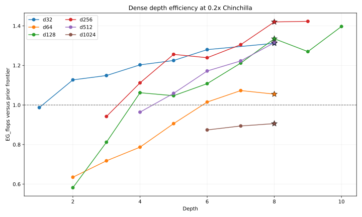

# Dense Depth Scaling

## Goal

Retune the dense recipe's depth allocation at the default `0.2x` Chinchilla
ratio while holding expansion ratio, activation, batch scaling, and the
parameter-based learning-rate law fixed. Steps and learning rate were recomputed
for every depth so each candidate retained the same samples-per-parameter target.

The sweep ran 30 candidates on Modal B200s with up to 10 concurrent jobs. All
runs completed with zero detected loss spikes. W&B runtimes sum to 2,576 seconds,
or approximately `$4.47` at `$6.25` per B200-hour.

## Results

The previous increasing law, which produced depths `2, 3, 4, 5, 5, 6`, was
substantially too shallow. The sweep did not identify a credible monotonic depth
law: the best measured depths were `8, 7, 10, 9, 7, 7`. A constant depth of 8
captures nearly all of the observed gain without encoding those noisy,
non-monotonic optima into the family recipe.

| Width | Previous depth | Depth-8 loss | Policy top-1 | Prior EG_flops | Depth-8 EG_flops | W&B |
| --- | ---: | ---: | ---: | ---: | ---: | --- |
| d32 | 2 | 4.0839 | 21.39% | 1.127x | 1.312x | [run](https://wandb.ai/maxence-frenette/chess-engine-4/runs/a06lv363) |
| d64 | 3 | 3.8052 | 27.15% | 0.718x | 1.055x | [run](https://wandb.ai/maxence-frenette/chess-engine-4/runs/l2ceek0g) |
| d128 | 4 | 3.4849 | 33.26% | 1.062x | 1.335x | [run](https://wandb.ai/maxence-frenette/chess-engine-4/runs/votcuh04) |
| d256 | 5 | 3.2311 | 39.56% | 1.256x | 1.420x | [run](https://wandb.ai/maxence-frenette/chess-engine-4/runs/f25b7mud) |
| d512 | 5 | 3.0317 | 45.22% | 1.059x | 1.315x | [run](https://wandb.ai/maxence-frenette/chess-engine-4/runs/nd28y2wg) |
| d1024 | 6 | 2.8882 | 49.73% | 0.874x | 0.906x | [run](https://wandb.ai/maxence-frenette/chess-engine-4/runs/mx52cvvn) |

`EG_flops` values use the pre-experiment loss/FLOPs curve, so every candidate is
compared against one fixed reference. A star marks the depth-8 run promoted into
the constant-depth recipe.



## Conclusion

The recipe now uses depth 8 at every width. Width already scales each layer's
parameters and FLOPs quadratically, and the sweep provides no evidence for
compounding that growth with a monotonic depth law. Constant depth is also much
less likely to overfit inter-run variance than the per-width winners.

The d512 and d1024 depth-8 refreshes completed after the initial sweep. Both
improved raw loss over depth 7. Under the current post-sweep frontier, d512's
same-width `EG_flops` was effectively unchanged (`0.564x` to `0.567x`) and
d1024 regressed (`0.224x` to `0.209x`). They are nevertheless canonical because
the family deliberately uses one constant depth rather than per-width optima.
The two refreshes added 1,860 seconds of B200 runtime, or approximately `$3.23`.

`experiments/throughput-dense.toml` measures the superseded shallower shapes and
is now stale. Rerun the throughput sweep before using it for dollar-cost
allocation.

## Commands

Representative command:

```sh
uv run train-modal --config configs/dense.py --d-model 256 --training-ratio 0.2 --depth 9 --steps 11496 --lr 0.0006 --wandb-name depthlaw-r02-d256x9
uv run python experiments/2026-08-04.03-dense-depth-scaling/analyze.py
```
