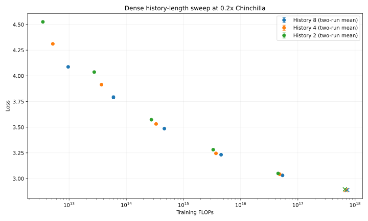
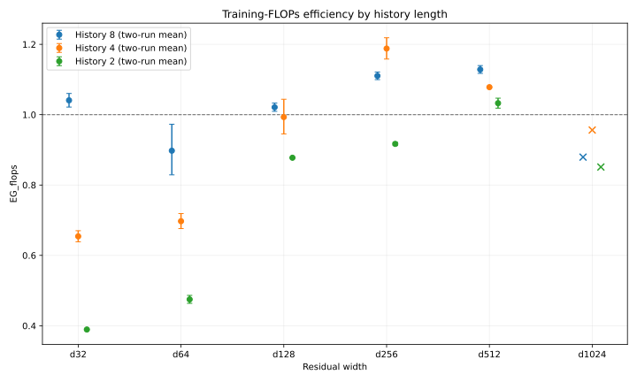

# Dense History Length

## Goal

Test whether the dense family needs all eight LCZero history positions. The
model continues to accept the standard 112-plane lc0 input, but retains only the
newest `13 * history_length` history planes plus all eight auxiliary planes.

The valid sweep used the canonical `0.2x` recipe at d32-d1024. Parameter count,
steps, samples, learning rate, and measured FLOPs were recomputed for each
history length. Every d32-d512 configuration was run with seeds 1 and 2; the
table reports the mean EMA loss and `EG_flops` calculated from that mean. All
runs completed with zero detected loss spikes.

## Results

| Width | History 8 mean loss / EG | History 4 mean loss / EG | History 2 mean loss / EG |
| --- | ---: | ---: | ---: |
| d32 | 4.0875 / 1.041x | 4.3117 / 0.654x | 4.5258 / 0.389x |
| d64 | 3.7925 / 0.898x | 3.9146 / 0.697x | 4.0369 / 0.475x |
| d128 | 3.4863 / 1.021x | 3.5317 / 0.993x | 3.5728 / 0.878x |
| d256 | 3.2320 / 1.110x | 3.2450 / 1.188x | 3.2809 / 0.917x |
| d512 | 3.0310 / 1.128x | 3.0424 / 1.078x | 3.0498 / 1.033x |
| d1024 (one run) | 2.8882 / 0.879x | 2.8871 / 0.956x | 2.8950 / 0.851x |

Mean policy top-1 provides the same broad ordering:

| Width | History 8 | History 4 | History 2 |
| --- | ---: | ---: | ---: |
| d32 | 21.40% | 19.56% | 18.38% |
| d64 | 27.22% | 25.81% | 24.68% |
| d128 | 33.23% | 32.60% | 32.16% |
| d256 | 39.56% | 39.38% | 38.59% |
| d512 | 45.22% | 45.16% | 45.17% |
| d1024 (one run) | 49.73% | 49.84% | 49.55% |





Error bars span the two observed seeds in both charts. Crosses mark the
single-run d1024 follow-up and are not included in the replicated conclusion.

## Conclusion

History 2 is consistently less FLOPs-efficient than history 8. History 4 is
clearly worse at d32 and d64, is 2.7% less efficient at d128, becomes 7.0% more
efficient at d256, then falls 4.4% behind at d512. This isolated d256 win is not
a clean scale-dependent crossover. The history-4 result is therefore
inconclusive, and history 8 remains the canonical default. The configurable
history-length flag is retained so history 4 can be revisited at larger scales.

The single d1024 history-4 run remains promising: it reached slightly lower
loss with approximately 6% fewer training FLOPs. It needs an independent
replicate before it can override the replicated d512 result.

## Replicates

| Width | History 8 | History 4 | History 2 |
| --- | --- | --- | --- |
| d32 | [seed 1](https://wandb.ai/maxence-frenette/chess-engine-4/runs/a06lv363), [seed 2](https://wandb.ai/maxence-frenette/chess-engine-4/runs/q5bq5go9) | [seed 1](https://wandb.ai/maxence-frenette/chess-engine-4/runs/xotsllxm), [seed 2](https://wandb.ai/maxence-frenette/chess-engine-4/runs/vmdsz0qh) | [seed 1](https://wandb.ai/maxence-frenette/chess-engine-4/runs/snevjhcr), [seed 2](https://wandb.ai/maxence-frenette/chess-engine-4/runs/jsv02ohw) |
| d64 | [seed 1](https://wandb.ai/maxence-frenette/chess-engine-4/runs/l2ceek0g), [seed 2](https://wandb.ai/maxence-frenette/chess-engine-4/runs/l84wbyl6) | [seed 1](https://wandb.ai/maxence-frenette/chess-engine-4/runs/0fg88lql), [seed 2](https://wandb.ai/maxence-frenette/chess-engine-4/runs/3bclts5h) | [seed 1](https://wandb.ai/maxence-frenette/chess-engine-4/runs/ohz4yyl0), [seed 2](https://wandb.ai/maxence-frenette/chess-engine-4/runs/eus0ljzj) |
| d128 | [seed 1](https://wandb.ai/maxence-frenette/chess-engine-4/runs/votcuh04), [seed 2](https://wandb.ai/maxence-frenette/chess-engine-4/runs/8zex42az) | [seed 1](https://wandb.ai/maxence-frenette/chess-engine-4/runs/f6dtwuyn), [seed 2](https://wandb.ai/maxence-frenette/chess-engine-4/runs/md5jksmi) | [seed 1](https://wandb.ai/maxence-frenette/chess-engine-4/runs/q4zftuuv), [seed 2](https://wandb.ai/maxence-frenette/chess-engine-4/runs/bnclm3sm) |
| d256 | [seed 1](https://wandb.ai/maxence-frenette/chess-engine-4/runs/f25b7mud), [seed 2](https://wandb.ai/maxence-frenette/chess-engine-4/runs/ocgxu3du) | [seed 1](https://wandb.ai/maxence-frenette/chess-engine-4/runs/fgjj9k12), [seed 2](https://wandb.ai/maxence-frenette/chess-engine-4/runs/gdfdln32) | [seed 1](https://wandb.ai/maxence-frenette/chess-engine-4/runs/t35j8a85), [seed 2](https://wandb.ai/maxence-frenette/chess-engine-4/runs/84g9f1ew) |
| d512 | [seed 1](https://wandb.ai/maxence-frenette/chess-engine-4/runs/nd28y2wg), [seed 2](https://wandb.ai/maxence-frenette/chess-engine-4/runs/wfdmf85u) | [seed 1](https://wandb.ai/maxence-frenette/chess-engine-4/runs/ci37wvn3), [seed 2](https://wandb.ai/maxence-frenette/chess-engine-4/runs/tkubwafg) | [seed 1](https://wandb.ai/maxence-frenette/chess-engine-4/runs/feke9ehl), [seed 2](https://wandb.ai/maxence-frenette/chess-engine-4/runs/w2j9n1l8) |

The first attempted replications reused seed 1 and reproduced the original
trajectories. They are excluded from every mean above. This prompted adding a
`--seed` training override; the replacement runs use seed 2.

## Pilot

An initial pass held the history-8 steps and learning rate fixed. That pass made
shorter histories look substantially better because reducing the input
projection also reduced parameter count, unintentionally increasing samples per
parameter. Those ten runs are not used for selection. The pilot prompted making
`history_length` a recipe input so subsequent comparisons preserve the intended
Chinchilla ratio.

The pilot, corrected sweep, d1024 follow-up, and all replications consumed
4,234.1 aggregate B200-seconds, about `$7.35` at the current Modal price.

## Command

Representative corrected run:

```sh
uv run train-modal --d-model 256 --history-length 4 \
  --wandb-name history-recipe-h4-d256
```
