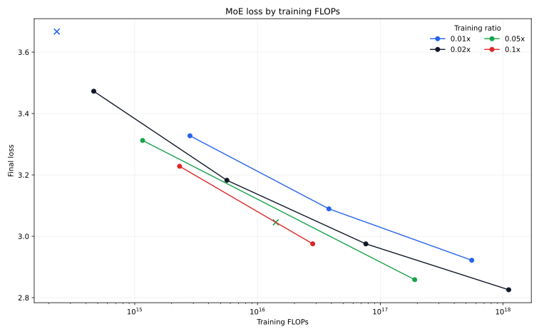
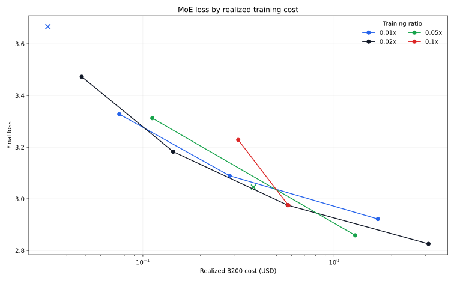

# MoE Training Ratio Sweep

## Goal

Determine the constant Chinchilla training ratio that minimizes realized B200
training cost for the `moe64a2` family. The sweep compares `0.01x`, `0.02x`,
`0.05x`, and `0.1x` ratios across widths from `d128` through `d1024`.

Runs are accepted with zero dead experts and at most one detected loss spike.
The `d128` `0.01x` run is rejected because it ended with three dead experts;
the `d256` `0.05x` run is rejected because it recorded two loss spikes.

## Learning Rate Calibration

The previous training-ratio exponent of `-0.63` was too steep. At `d128`, the
predicted `0.01x` learning rates left 7-15 dead experts, while the predicted
`0.1x` rates were conservatively low. Refinement at `d128` and validation at
`d256` produced these endpoint optima:

| Width | `0.01x` LR | `0.1x` LR | Implied exponent |
| ---: | ---: | ---: | ---: |
| d128 | 2.7e-3 | 1.8e-3 | -0.176 |
| d256 | 1.4e-3 | 9.0e-4 | -0.192 |

The canonical recipe now uses:

```text
lr = 518 * total_parameters^-0.74 * training_ratio^-0.18
```

This preserves the established learning rates at the canonical `0.02x` ratio
while producing substantially flatter extrapolation across training ratios.

## Selected Results

| Width | Ratio | LR | FLOPs | Loss | Policy top-1 | Cost | Spikes | Dead | W&B |
| ---: | ---: | ---: | ---: | ---: | ---: | ---: | ---: | ---: | --- |
| d128 | 0.01x | 2.7e-3 | 2.32e14 | 3.6670 | 29.61% | $0.032 | 0 | 3 | [run](https://wandb.ai/maxence-frenette/chess-engine-4/runs/jcadqm56) |
| d128 | 0.02x | 3.3e-3 | 4.64e14 | 3.4726 | 33.69% | $0.048 | 0 | 0 | [run](https://wandb.ai/maxence-frenette/chess-engine-4/runs/s1nwf38y) |
| d128 | 0.05x | 2.2e-3 | 1.16e15 | 3.3122 | 37.63% | $0.112 | 0 | 0 | [run](https://wandb.ai/maxence-frenette/chess-engine-4/runs/0lincsl8) |
| d128 | 0.1x | 1.8e-3 | 2.32e15 | 3.2280 | 40.08% | $0.315 | 0 | 0 | [run](https://wandb.ai/maxence-frenette/chess-engine-4/runs/3xvs44s7) |
| d256 | 0.01x | 1.4e-3 | 2.82e15 | 3.3275 | 37.45% | $0.075 | 0 | 0 | [run](https://wandb.ai/maxence-frenette/chess-engine-4/runs/c08txk5z) |
| d256 | 0.02x | 1.2e-3 | 5.63e15 | 3.1824 | 41.36% | $0.144 | 0 | 0 | [run](https://wandb.ai/maxence-frenette/chess-engine-4/runs/5kcj5a04) |
| d256 | 0.05x | 1.0e-3 | 1.41e16 | 3.0454 | 45.14% | $0.379 | 2 | 0 | [run](https://wandb.ai/maxence-frenette/chess-engine-4/runs/cz4w67rx) |
| d256 | 0.1x | 9.0e-4 | 2.82e16 | 2.9753 | 47.16% | $0.576 | 1 | 0 | [run](https://wandb.ai/maxence-frenette/chess-engine-4/runs/i6ut3pkj) |
| d512 | 0.01x | 4.9e-4 | 3.81e16 | 3.0893 | 44.14% | $0.284 | 0 | 0 | [run](https://wandb.ai/maxence-frenette/chess-engine-4/runs/2dxqgtd6) |
| d512 | 0.02x | 4.4e-4 | 7.63e16 | 2.9752 | 47.49% | $0.572 | 0 | 0 | [run](https://wandb.ai/maxence-frenette/chess-engine-4/runs/64th71sp) |
| d512 | 0.05x | 3.7e-4 | 1.91e17 | 2.8586 | 50.87% | $1.290 | 0 | 0 | [run](https://wandb.ai/maxence-frenette/chess-engine-4/runs/gmrgabmv) |
| d1024 | 0.01x | 1.8e-4 | 5.56e17 | 2.9218 | 49.31% | $1.695 | 1 | 0 | [run](https://wandb.ai/maxence-frenette/chess-engine-4/runs/5dvjt7s9) |
| d1024 | 0.02x | 1.6e-4 | 1.11e18 | 2.8257 | 52.22% | $3.117 | 1 | 0 | [run](https://wandb.ai/maxence-frenette/chess-engine-4/runs/wmpvk8ot) |

Rejected runs remain plotted as crosses so the routing and stability constraints
are visible rather than silently discarded.





## Undertraining Fit

Anchoring the physical-FLOPs curve at `0.02x` and fitting the additional loss
from undertraining gives:

```text
L_0.02(C) = 2.5089 + 119.7 * C^-0.1428

penalty = 0.482764
        * (C_0.02 / 1e15)^-0.069163
        * ((ratio / 0.02)^-0.411025 - 1)
```

The joint fit has RMSE `0.00220`. This fit is descriptive; the cost conclusion
uses interpolation between measured runtimes rather than fitting a cost curve.

| Target loss | Cheapest measured ratio | Interpolated cost |
| ---: | ---: | ---: |
| 3.30 | 0.01x | $0.088 |
| 3.20 | 0.02x | $0.135 |
| 3.10 | 0.02x | $0.249 |
| 3.00 | 0.02x | $0.485 |
| 2.95 | 0.02x | $0.762 |
| 2.90 | 0.05x | $1.032 |
| 2.86 | 0.05x | $1.280 |

## Conclusion

Use **`0.02x` Chinchilla as the default constant ratio for MoE experiments**.
It is the cheapest allocation across the broad middle of the measured loss
range, remains stable from `d128` through `d1024`, and avoids the dead-expert
risk seen at `0.01x`. The `0.01x` ratio only has a narrow cost advantage near
loss `3.3`, while `0.1x` never wins within the measured range.

Use `0.05x` selectively for final, higher-quality runs targeting loss below
approximately `2.94`. The clearest direct comparison is that `d512` at `0.05x`
reaches loss `2.8586` for `$1.29`, while `d1024` at `0.01x` costs `$1.70` and
only reaches loss `2.9218`.

The experiment launched 22 runs, including learning-rate calibration and
rejected candidates. Their recorded W&B runtimes total 4,442.5 seconds, or
`$7.71` at `$6.25` per B200 hour. This includes the expanded round-number ratio
grid and the additional learning-rate calibration authorized for this sweep.
