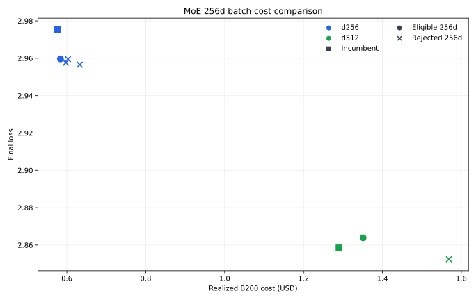

# MoE 256d Batch Cost

## Goal

Test whether doubling the canonical MoE batch from `128d` to `256d` improves
realized loss per dollar when the throughput gain is reinvested into additional
training. The `d256` and `d512` candidates receive approximately the same B200
runtime as stronger existing incumbents rather than holding the sample count
fixed.

## Throughput

Both profiles used 50 warmup steps and 500 measured steps.

| Width | `128d` samples/s | `256d` samples/s | Gain | Cost/sample reduction |
| ---: | ---: | ---: | ---: | ---: |
| d256 | 1.71M | 2.15M | **1.26x** | **20.6%** |
| d512 | 1.51M | 1.76M | **1.16x** | **14.2%** |

The larger batch is faster at both widths. Exposed GPU idle time remained below
`0.3 ms/step`, so neither profile was dataloader-bound.

## Training Results

Runs are eligible with zero dead experts and at most one detected loss spike.

| Width | Batch | Steps | Ratio | LR | Loss | Cost | Spikes | Dead | W&B |
| ---: | ---: | ---: | ---: | ---: | ---: | ---: | ---: | ---: | --- |
| d256 incumbent | 32,768 | 16,207 | 0.100x | 9.0e-4 | 2.9753 | $0.576 | 1 | 0 | [run](https://wandb.ai/maxence-frenette/chess-engine-4/runs/i6ut3pkj) |
| d256 | 65,536 | 10,880 | 0.134x | 9.0e-4 | **2.9597** | $0.584 | 1 | 0 | [run](https://wandb.ai/maxence-frenette/chess-engine-4/runs/irdq63jz) |
| d256 | 65,536 | 10,880 | 0.134x | 1.1e-3 | 2.9576 | $0.597 | 2 | 0 | [run](https://wandb.ai/maxence-frenette/chess-engine-4/runs/sfvddn6q) |
| d256 | 65,536 | 10,880 | 0.134x | 1.4e-3 | 2.9566 | $0.633 | 3 | 0 | [run](https://wandb.ai/maxence-frenette/chess-engine-4/runs/pooog6g4) |
| d256 | 65,536 | 10,880 | 0.134x | 1.7e-3 | 2.9595 | $0.603 | 3 | 0 | [run](https://wandb.ai/maxence-frenette/chess-engine-4/runs/sbownxd4) |
| d512 incumbent | 65,536 | 16,023 | 0.050x | 3.7e-4 | **2.8586** | **$1.290** | 0 | 0 | [run](https://wandb.ai/maxence-frenette/chess-engine-4/runs/gmrgabmv) |
| d512 | 131,072 | 9,970 | 0.062x | 3.6e-4 | 2.8639 | $1.351 | 1 | 0 | [run](https://wandb.ai/maxence-frenette/chess-engine-4/runs/xv65eu3s) |
| d512 | 131,072 | 9,970 | 0.062x | 4.4e-4 | 2.8524 | $1.569 | 2 | 0 | [run](https://wandb.ai/maxence-frenette/chess-engine-4/runs/fj2ripu2) |

## Conclusion

`256d` produces a small realized-efficiency gain at `d256`. The eligible
candidate improves loss from `2.9753` to `2.9597` for 1.3% more cost. Against
log-cost interpolation between the measured `d512` `0.02x` and `0.05x`
frontier points, reaching this loss would normally cost about `$0.638`; the
candidate costs `$0.584`, an estimated **8.5% cost reduction**.

The gain does not transfer to `d512`. Its eligible candidate is strictly worse
than the incumbent: loss `2.8639` instead of `2.8586` at 4.7% greater cost. The
`4.4e-4` candidate reaches a slightly lower loss but has two spikes and costs
21.6% more, so it is rejected.

Keep `128d` as the canonical family-wide batch. `256d` may be useful for small
MoE widths, but the diminishing throughput gain and reduced optimizer-step count
erase its systems advantage by `d512`. Doubling batch size also did not require
an LR increase: the only eligible `d256` candidate retained the incumbent LR.

The six new training runs and two profiles cost `$5.44` at `$6.25` per B200
hour. The extra `d256` run was required after the initial LR grid produced only
spiky candidates.
