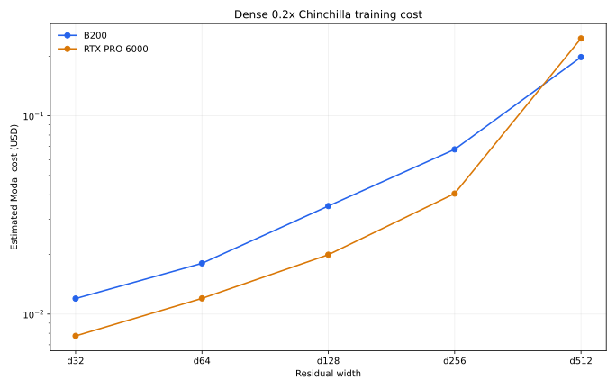

# RTX PRO 6000 training cost

## Goal

Determine where Modal's RTX PRO 6000 reduces dense training cost relative to
B200 without changing model, batch, precision, input pipeline, or optimizer.
The canonical 50-step warmup and 500-step production-loop profile was used for
each width.

Modal currently charges `$0.000842/s` for RTX PRO 6000 and `$0.001736/s` for
B200. RTX therefore wins on GPU cost when it is less than `2.06x` slower. With
the shared eight-core CPU request included, the conservative break-even point is
`1.94x`. Reported costs include the GPU and reserved CPU, but exclude variable
memory billing.

## Dense results

| Width | Precision | B200 ms/step | RTX ms/step | Slowdown | RTX cost ratio | Savings |
| ---: | --- | ---: | ---: | ---: | ---: | ---: |
| d32 | BF16 | 1.70 | 2.14 | 1.26x | 0.65x | **35.2%** |
| d64 | BF16 | 2.05 | 2.65 | 1.29x | 0.67x | **33.4%** |
| d128 | BF16 | 2.84 | 3.14 | 1.10x | 0.57x | **43.2%** |
| d256 | BF16 | 3.49 | 4.06 | 1.16x | 0.60x | **40.1%** |
| d512 | BF16 | 5.90 | 14.24 | 2.42x | 1.24x | **-24.2%** |

For the canonical `0.2x` runs, the corresponding estimates are:

| Width | B200 cost | RTX cost | Savings |
| ---: | ---: | ---: | ---: |
| d32 | $0.012 | $0.008 | **35.2%** |
| d64 | $0.018 | $0.012 | **33.4%** |
| d128 | $0.035 | $0.020 | **43.2%** |
| d256 | $0.068 | $0.041 | **40.1%** |
| d512 | $0.198 | $0.246 | **-24.2%** |



The canonical mixed-GPU profiles are stored in
`experiments/throughput-dense.toml`.

## Larger models and MoE

Transformer Engine 2.17 rejects the canonical MXFP8 recipe on the RTX PRO
6000's SM120 architecture with `MXFP8 ... is not supported on 12.0+
architectures yet`. A d1024 BF16 probe did run, but took `75.75 ms/step` versus
`22.09 ms/step` for B200 MXFP8, making RTX approximately 77% more expensive even
before accounting for the unwanted precision change.

The canonical MoE family also requires MXFP8. A forced BF16 d128 MoE probe hit a
Transformer Engine grouped-linear CUDA-graph capture error, so no alternate MoE
runtime path was retained. Custom ThunderKittens kernels compile for SM100 and
remain B200-only.

## Conclusion

Use RTX PRO 6000 for dense d32 through d256 and B200 for dense d512 and larger.
Keep all MoE and custom-kernel runs on B200. The Python recipes now encode this
map in `InfraConfig.gpu`, while `--gpu` remains available for controlled
profiling overrides.

Command for refreshing the retained mixed-GPU sweep:

```sh
uv run throughput-sweep --refresh
```

## Sources

- [Modal GPU identifiers](https://modal.com/docs/guide/gpu)
- [Modal resource pricing](https://modal.com/pricing)
- [NVIDIA RTX Blackwell architecture and specifications](https://www.nvidia.com/content/dam/en-zz/Solutions/design-visualization/quadro-product-literature/pdf/NVIDIA-RTX-Blackwell-PRO-GPU-Architecture-v1_1.pdf)
- [Transformer Engine MXFP8 support matrix](https://docs.nvidia.com/deeplearning/transformer-engine/user-guide/features/low_precision_training/mxfp8/mxfp8.html)
