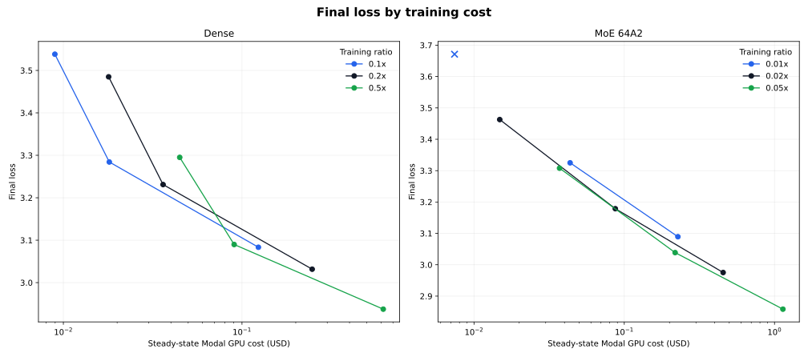

# Training ratio refresh

## Goal

Reevaluate whether the default Chinchilla ratios allocate enough optimizer steps
after the GPU, kernel, Parquet loader, and input-pipeline changes. Dense models
were tested at `0.1x`, `0.2x`, and `0.5x`; MoE models at `0.01x`, `0.02x`, and
`0.05x`, across d128, d256, and d512.

The d128 and d256 MoE `0.02x` anchors were rerun because those widths now use
custom BF16 kernels on RTX PRO 6000 instead of TE MXFP8 on B200. Other anchors
reuse compatible canonical runs. Candidates used the family learning-rate law
without additional tuning. Runs with no dead experts and at most one detected
loss spike are eligible. New runs used commit `38924d8`; every run and W&B URL
is recorded in [`results.toml`](results.toml).

## Cost methodology

The chart uses final `loss/task[ema=0.99]` and steady-state step times from the
fresh `experiments/throughput-*.toml` sweeps. Dollar cost includes the configured
GPU at Modal's current rates of `$0.000842/s` for RTX PRO 6000 and `$0.001736/s`
for B200. CPU, memory, startup, and compilation are excluded from chart points so
that model allocations are compared on the same basis.



## Dense results

| Width | 0.1x loss | 0.2x loss | 0.5x loss |
| ---: | ---: | ---: | ---: |
| d128 | 3.5382 | 3.4849 | 3.2951 |
| d256 | 3.2843 | 3.2311 | 3.0898 |
| d512 | 3.0833 | 3.0317 | 2.9375 |

The corresponding `EG_flops` values against the current dense frontier are:

| Width | 0.1x | 0.2x | 0.5x |
| ---: | ---: | ---: | ---: |
| d128 | 1.35x | 1.03x | 2.27x |
| d256 | 1.29x | 1.12x | 2.39x |
| d512 | 1.10x | 1.12x | 1.96x |

Interpolating between measured widths, `0.1x` is cheapest from loss 3.5 through
approximately 3.15. The longer `0.5x` horizon becomes cheapest around loss 3.1
and remains best through the bottom of the measured range. At target loss 3.1,
the interpolated costs are `$0.105` for `0.1x`, `$0.128` for `0.2x`, and `$0.087`
for `0.5x`. At loss 3.0, only `0.5x` brackets the target, at `$0.281`.

## MoE results

| Width | 0.01x loss | 0.02x loss | 0.05x loss |
| ---: | ---: | ---: | ---: |
| d128 | 3.6711 (invalid) | 3.4628 | 3.3078 |
| d256 | 3.3249 | 3.1787 | 3.0387 |
| d512 | 3.0893 | 2.9752 | 2.8584 |

The corresponding `EG_flops` values against the current MoE frontier are:

| Width | 0.01x | 0.02x | 0.05x |
| ---: | ---: | ---: | ---: |
| d128 | 0.54x (invalid) | 1.07x | 1.49x |
| d256 | 0.53x | 1.05x | 2.17x |
| d512 | 0.42x | 0.98x | 2.95x |

The d128 `0.01x` run ended with seven dead experts and is excluded. `0.02x` is
best near loss 3.4, but `0.05x` becomes narrowly cheapest around loss 3.3 and
its advantage grows with quality. At loss 3.1, interpolated cost falls from
`$0.165` at `0.02x` to `$0.146` at `0.05x`; at loss 3.0 it falls from `$0.372`
to `$0.311`. The d512 `0.05x` point reaches 2.8584 for `$1.138`, while the
current d1024 `0.02x` recipe costs about `$2.92` and reaches 2.8257.

## Conclusion

More steps are cost-effective for both families once the target loss is low
enough. A single constant ratio is still the wrong policy. This experiment does
not promote any candidate or change either canonical ratio; it establishes
target-dependent guidance for future runs:

- Keep dense `0.2x` as a conservative routine-experiment default. Prefer about
  `0.1x` for cheap screening and `0.5x` for high-quality runs near loss 3.1 or
  below.
- Keep MoE `0.02x` for cheap early screening. Prefer `0.05x` for serious d256+
  runs and targets around loss 3.3 or below.
- Do not use MoE `0.01x` at d128; dead experts remain reproducible at that
  horizon.

The 14 completed runs consumed approximately `$2.77` of GPU time. The aborted
first launcher briefly started ten jobs before the eight-job limit was applied,
adding about `$0.15`; estimated CPU and memory charges keep the total below
`$3.5`, safely inside the `$5` budget.

The temporary launcher did not resolve `.env` from the repository and therefore
logged new runs to W&B's `uncategorized` project. The linked runs and metrics are
valid; future launchers must load the repository `.env` by explicit path.

## Commands

Representative commands:

```sh
uv run train-modal --config configs/dense.py --d-model 512 --training-ratio 0.5
uv run train-modal --config configs/moe64a2.py --d-model 512 --training-ratio 0.05
uv run python experiments/2026-08-06.03-training-ratio-refresh/analyze.py
```

## Sources

- [Modal pricing](https://modal.com/pricing)
