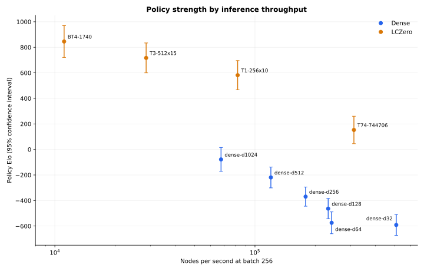

# Dense Policy Elo Tournament

## Goal

Re-evaluate the current canonical dense scaling ladder against the retained
LCZero reference networks using raw policy play.

## Protocol

| Item | Value |
| --- | ---: |
| Dense models | d32, d64, d128, d256, d512, d1024 |
| LCZero models | BT4, T1, T3, T74 |
| Adaptive waves | 4 |
| Games per matchup | 64 |
| Total games | 1,280 |
| Effective policy batch | 256 |
| GPU | RTX PRO 6000 |
| Aggregate GPU time | 66.79 seconds |
| Estimated GPU cost | $0.056 |

All games use mirrored two-move openings from `noob_2moves.pgn`. Policy mode
plays the highest-policy legal move without MCTS, so this measures policy Elo,
not searched engine strength.

## Results



| Rank | Engine | Elo | 95% CI |
| ---: | --- | ---: | ---: |
| 1 | BT4-1740 | +845.5 | +/-124.7 |
| 2 | T3-512x15 | +717.0 | +/-117.1 |
| 3 | T1-256x10 | +581.6 | +/-114.3 |
| 4 | T74-744706 | +152.7 | +/-107.4 |
| 5 | dense-d1024 | -78.3 | +/-93.2 |
| 6 | dense-d512 | -219.4 | +/-81.8 |
| 7 | dense-d256 | -369.5 | +/-75.2 |
| 8 | dense-d128 | -463.5 | +/-79.3 |
| 9 | dense-d64 | -574.6 | +/-85.5 |
| 10 | dense-d32 | -591.4 | +/-82.2 |

The dense models improve monotonically from d64 through d1024. The d32 and d64
confidence intervals overlap substantially. Across the six dense models, the
fitted policy scaling trend is **109.6 Elo per decade of training FLOPs**.
Dense d1024 trails T74 by 231 Elo in this policy-only protocol.

## Throughput

`backendbench` evaluated every model at batch 256 on the same RTX PRO 6000 GPU.

| Engine | Nodes/s |
| --- | ---: |
| dense-d32 | 508,237 |
| T74-744706 | 312,208 |
| dense-d64 | 241,630 |
| dense-d128 | 232,225 |
| dense-d256 | 179,088 |
| dense-d512 | 120,085 |
| T1-256x10 | 81,944 |
| dense-d1024 | 67,677 |
| T3-512x15 | 28,590 |
| BT4-1740 | 11,125 |

## Command

```bash
uv run eval-tournament-modal \
  --config configs/eval/policy-elo.toml \
  --output experiments/2026-08-06.05-policy-elo-tournament/results.json

uv run benchmark-tournament-modal \
  --config configs/eval/policy-elo.toml \
  --output experiments/2026-08-06.05-policy-elo-tournament/backendbench.json
```

The raw JSON records every pairing, W/D/L count, runtime, fitted rating, and
confidence interval.
