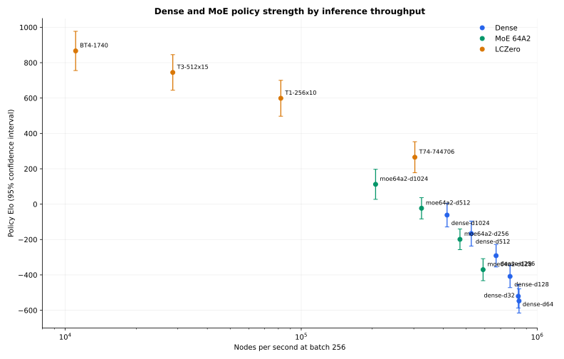

# Dense and MoE Policy Elo Tournament

## Goal

Validate the new native MoE inference path in lc0 and compare the canonical
MoE 64A2 ladder with the dense ladder and retained LCZero reference networks.

## Protocol

| Item | Value |
| --- | ---: |
| Dense models | d32 through d1024 |
| MoE models | d128, d256, d512, d1024 |
| LCZero models | BT4, T1, T3, T74 |
| Adaptive waves | 4 |
| Games per matchup | 64 |
| Total games | 1,792 |
| Effective policy batch | 256 |
| GPU | RTX PRO 6000 |
| Aggregate GPU time | 86.33 seconds |
| Estimated GPU cost | $0.072 |

All games use mirrored two-move openings from `noob_2moves.pgn`. Policy mode
plays the highest-policy legal move without MCTS, so this measures policy Elo,
not searched engine strength.

## Results



| Rank | Engine | Elo | 95% CI | Nodes/s |
| ---: | --- | ---: | ---: | ---: |
| 1 | BT4-1740 | +866.5 | +/-110.9 | 11,067 |
| 2 | T3-512x15 | +744.8 | +/-100.5 | 28,556 |
| 3 | T1-256x10 | +598.7 | +/-101.4 | 81,943 |
| 4 | T74-744706 | +265.3 | +/-87.7 | 303,029 |
| 5 | moe64a2-d1024 | +112.3 | +/-84.8 | 206,590 |
| 6 | moe64a2-d512 | -23.1 | +/-60.0 | 323,456 |
| 7 | dense-d1024 | -61.7 | +/-66.9 | 414,952 |
| 8 | dense-d512 | -166.2 | +/-70.6 | 525,674 |
| 9 | moe64a2-d256 | -198.8 | +/-58.5 | 470,640 |
| 10 | dense-d256 | -291.3 | +/-63.6 | 669,511 |
| 11 | moe64a2-d128 | -370.3 | +/-62.1 | 589,788 |
| 12 | dense-d128 | -408.5 | +/-63.3 | 767,284 |
| 13 | dense-d64 | -520.6 | +/-66.3 | 831,568 |
| 14 | dense-d32 | -547.1 | +/-68.3 | 837,543 |

Every MoE width improves monotonically, and each MoE model rates above the
same-width dense model. MoE d512 is 143 Elo ahead of dense d512, while the
optimized dense runtime is 1.63x faster at that width. Dense is faster than MoE
at every matched width; the throughput advantage grows from 1.30x at d128 to
2.01x at d1024. MoE d1024 is 174 Elo behind T74 in this policy-only protocol.

The monotonic within-family results and expected cross-family ordering are also
an end-to-end behavioral validation of Safetensors export, top-2 routing,
expert dispatch, and lc0 output handling. They do not replace a tensor-level
numerical comparison with the training model.

## Commands

```bash
uv run benchmark-tournament-modal \
  --config configs/eval/policy-elo.toml \
  --output experiments/2026-08-07.01-dense-moe-policy-elo/backendbench.json

uv run eval-tournament-modal \
  --config configs/eval/policy-elo.toml \
  --output experiments/2026-08-07.01-dense-moe-policy-elo/results.json
```

The raw JSON records every benchmark, pairing, W/D/L count, runtime, fitted
rating, and confidence interval.
