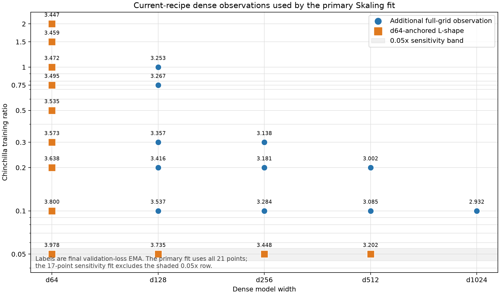
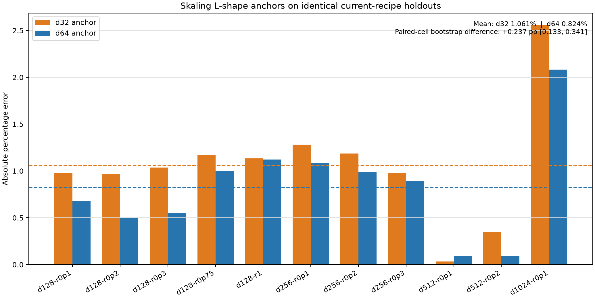

# Skaling law evaluation

## Goal

Test whether the coupled law from *Skaling: Chinchilla's Exponents Meet
Kaplan's Coupling* resolves the project's earlier failure to identify a useful
model/data scaling law. Dense and `moe64a2` are fitted separately:

```text
L(N,D) = (A * N^-alpha + B * D^-beta)^k + E
```

The additive Chinchilla baseline is the nested special case `k = 1`.
Coefficients use `N = parameters / 1e6` and `D = samples / 1e8`.

## Verdict

**Skaling now powers dense budget planning within the measured d64-d1024 width
range and bounded observed-ratio range. Unbounded model-size extrapolation
remains unsafe.** The expanded grid changed the dense conclusion:

- On all 23 current-recipe `d64+` observations, Skaling reduces full-fit MAPE
  from `0.797%` to `0.254%` and interpolation MAPE from `0.610%` to `0.256%`.
- Excluding the four very short `0.05x` observations improves full-fit MAPE to
  `0.170%` versus Chinchilla's `0.527%`; interpolation improves to `0.207%`. The
  fitted exponents also move away from their upper bounds.
- Skaling predicts held-out longer training much better (`0.146%` versus
  `1.247%` MAPE), but predicts the single held-out `d1024 0.1x` point much worse
  (`1.065%` versus `0.166%`). One point is not enough to identify size scaling.
- The full grid is essential. The `d64`-anchored L-shape alone gives `1.338%`
  held-out MAPE. It beats Chinchilla's `2.928%`, but is over five times worse
  than the full-grid Skaling fit.
- A matched nine-ratio d32 arm does not reverse the anchor choice. On eleven
  identical off-arm holdouts, d64-anchored Skaling scores `0.824%` MAPE versus
  `1.061%` for d32. The paired-cell difference is `+0.237` percentage points
  with a bootstrap 95% interval of `[0.133, 0.341]` in favor of d64.

The main earlier failure was not `d32` alone. Matched current-recipe `0.2x`
reruns at `d64/d128/d256/d512` all beat the old canonical losses, by
`0.167/0.069/0.050/0.030` loss respectively. Mixing those old anchors with new
observations raises Skaling full-fit MAPE from `0.245%` to `0.585%`. The `0.05x`
runs are a smaller, separately measurable distortion, probably because these
jobs are too short to reach the asymptotic training regime.

The 19 useful current-recipe `d64+`, `>=0.1x` observations are promoted to
`[scaling_runs]` in `experiments/best-runs-dense.toml`. The existing `[runs]`
section remains the fixed-`0.2x` source used by `compare-run` and the website.

## Dense observations



The primary fit uses all 23 current-recipe `d64+` observations shown above.
Orange squares are the requested `d64` L-shape: the complete `d64` data arm to
`2x` and the `0.05x` size arm through `d512`. Blue circles are the extra cells
that make the fit identifiable and expose which rows are inconsistent.

### d32 versus d64 anchor



The comparison is now matched: both anchors have current-recipe observations at
`0.05/0.1/0.2/0.3/0.5/0.75/1/1.5/2x`, both include the same `0.05x` size arm,
and both predict the same eleven `d128+`, above-`0.05x` holdouts. The d64 anchor
has lower Skaling error (`0.824%` versus `1.061%`) and lower Chinchilla error
(`2.586%` versus `3.005%`). A 20,000-resample paired bootstrap over the eleven
cells assigns `100%` probability that the d32 Skaling anchor is worse, but
does not capture training-seed uncertainty.

Adding d32 to the full current-recipe grid also degrades Skaling interpolation
MAPE from `0.256%` to `0.285%`. With `0.05x` excluded, it degrades from `0.207%`
to `0.274%`. The evidence now supports d64 as the fitted ladder anchor, while
retaining d32 as a cheap diagnostic scale.

On identical extrapolation targets, adding d32 increases the held-out d1024
error from `1.065%` to `1.709%`, or from `0.750%` to `1.332%` for the preferred
`>=0.1x` sensitivity. Its effect on held-out d64+ longest horizons is nearly
neutral with all ratios (`0.146%` to `0.161%`) but harmful with `0.05x` excluded
(`0.191%` to `0.349%`). D32 therefore provides no observed extrapolation gain;
its largest distortion is along the model-size axis.

## Dense fit

The primary current-recipe `d64+` fit is:

```text
Chinchilla:
L = 0.3816 * N^-0.2915 + 0.5818 * D^-0.1890 + 2.4110

Skaling:
L = (10.1971 * N^-1.9512 + 0.7132 * D^-1.7129)^0.09757 + 2.1890
```

| Regime | Chinchilla MAPE | Skaling MAPE |
| --- | ---: | ---: |
| Full fit, 23 rows | 0.797% | **0.254%** |
| Interpolation, 10 folds | 0.610% +/- 0.370% | **0.256% +/- 0.177%** |
| Extrapolation N, hold out d1024 | **0.166%** | 1.065% |
| Extrapolation D, hold out longest horizons | 1.247% | **0.146%** |
| d64 L-shape heldout | 2.928% | **1.338%** |

Leave-one-out influence identifies `d1024 0.1x`, `d128 0.05x`, and
`d64 0.05x` as the three hardest points, with Skaling held-out errors of
`1.207%`, `1.049%`, and `0.948%`. Across all leave-one-out fits, `k` remains in
`[0.081, 0.112]`; the coupling itself is stable. Some fits put `alpha` near its
upper bound, motivating the `>=0.1x` sensitivity below.

### Excluding 0.05x

```text
Skaling:
L = (1.1360 * N^-1.4712 + 0.1368 * D^-1.2897)^0.15945 + 2.4066
```

| Regime | Chinchilla MAPE | Skaling MAPE |
| --- | ---: | ---: |
| Full fit, 19 rows | 0.527% | **0.170%** |
| Interpolation, 7 folds | 0.448% +/- 0.259% | **0.207% +/- 0.129%** |
| Extrapolation N, hold out d1024 | **0.516%** | 0.750% |
| Extrapolation D, hold out longest horizons | 0.916% | **0.191%** |
| Completed 0.1x L-shape heldout | 1.607% | **1.221%** |

This is the cleanest descriptive fit. It is a sensitivity result rather than
the primary benchmark because removing observations after inspecting residuals
can make in-sample results optimistic.

## Data and fitting

Inputs are canonical `runs` and `allocation_runs` from
`experiments/best-runs-dense.toml` and
`experiments/best-runs-moe64a2.toml`, plus isolated observations in
`new-runs.toml`. The primary dense result uses only rows generated from source
commit `b5bcb851`, with `d32` excluded. All compared laws use the same rows and
splits and use final validation-loss EMA.

Fits minimize Huber loss (`delta = 0.05`) on log loss with 64 deterministic
Sobol multistarts and bounded least squares. Bounds follow the paper: positive
amplitudes; `alpha`, `beta`, and Skaling `k` in `[0.01, 2]`; `E` in `[0, 3]`.
Evaluation includes leave-one-cell-out interpolation, largest-width
extrapolation, longest-horizon extrapolation, L-shape holdout, and
leave-one-observation influence refits.

## d64+ follow-up runs

The d64+ follow-ups added 22 dense runs. D256 `0.1x` recorded one isolated spike;
its EMA returned to trend immediately. All other runs reported zero spikes.
`EG_flops` is reported against the existing width trend; these are retained as
profiling evidence and are not automatically promoted.

| Width | Ratio | EMA loss | EG_flops | Runtime | W&B |
| --- | ---: | ---: | ---: | ---: | --- |
| d64 | 0.05x | 3.9784 | 1.203x | 9.6s | [fu5x4ldg](https://wandb.ai/maxence-frenette/uncategorized/runs/fu5x4ldg) |
| d64 | 0.2x refresh | 3.6381 | 2.512x | 26.5s | [le0zet8j](https://wandb.ai/maxence-frenette/uncategorized/runs/le0zet8j) |
| d64 | 0.3x | 3.5733 | 2.686x | 24.5s | [g2c1jlod](https://wandb.ai/maxence-frenette/uncategorized/runs/g2c1jlod) |
| d64 | 0.5x | 3.5355 | 2.150x | 35.8s | [mf306mun](https://wandb.ai/maxence-frenette/uncategorized/runs/mf306mun) |
| d64 | 0.75x | 3.4955 | 1.966x | 84.3s | [9j0sewuw](https://wandb.ai/maxence-frenette/uncategorized/runs/9j0sewuw) |
| d64 | 1.0x | 3.4717 | 1.789x | 70.5s | [2yi3k8lq](https://wandb.ai/maxence-frenette/uncategorized/runs/2yi3k8lq) |
| d64 | 1.5x | 3.4589 | 1.327x | 105.1s | [3ygng034](https://wandb.ai/maxence-frenette/uncategorized/runs/3ygng034) |
| d64 | 2.0x | 3.4473 | 1.096x | 208.5s | [2xrkwmir](https://wandb.ai/maxence-frenette/uncategorized/runs/2xrkwmir) |
| d128 | 0.05x | 3.7355 | 0.666x | 8.4s | [e3pis6m9](https://wandb.ai/maxence-frenette/uncategorized/runs/e3pis6m9) |
| d128 | 0.1x refresh | 3.5369 | 1.368x | 15.5s | [lywanz0i](https://wandb.ai/maxence-frenette/uncategorized/runs/lywanz0i) |
| d128 | 0.2x refresh | 3.4161 | 1.842x | 32.9s | [mvf2q9b3](https://wandb.ai/maxence-frenette/uncategorized/runs/mvf2q9b3) |
| d128 | 0.3x | 3.3571 | 2.087x | 40.4s | [4smpr2se](https://wandb.ai/maxence-frenette/uncategorized/runs/4smpr2se) |
| d128 | 0.75x | 3.2674 | 2.002x | 94.8s | [0spk3hr4](https://wandb.ai/maxence-frenette/uncategorized/runs/0spk3hr4) |
| d128 | 1.0x | 3.2527 | 1.748x | 124.8s | [ma5d219p](https://wandb.ai/maxence-frenette/uncategorized/runs/ma5d219p) |
| d256 | 0.05x | 3.4481 | 0.571x | 13.7s | [80pqvvv1](https://wandb.ai/maxence-frenette/uncategorized/runs/80pqvvv1) |
| d256 | 0.1x refresh | 3.2845 | 1.287x | 24.7s | [fbaqm6d7](https://wandb.ai/maxence-frenette/uncategorized/runs/fbaqm6d7) |
| d256 | 0.2x refresh | 3.1806 | 1.964x | 46.7s | [6kufmxzg](https://wandb.ai/maxence-frenette/uncategorized/runs/6kufmxzg) |
| d256 | 0.3x | 3.1381 | 2.165x | 72.2s | [fbibhzvv](https://wandb.ai/maxence-frenette/uncategorized/runs/fbibhzvv) |
| d512 | 0.05x | 3.2020 | 0.519x | 45.8s | [oy5gf3t8](https://wandb.ai/maxence-frenette/uncategorized/runs/oy5gf3t8) |
| d512 | 0.1x refresh | 3.0847 | 1.076x | 60.7s | [13xpo9r5](https://wandb.ai/maxence-frenette/uncategorized/runs/13xpo9r5) |
| d512 | 0.2x refresh | 3.0019 | 1.733x | 116.0s | [irfjpljb](https://wandb.ai/maxence-frenette/uncategorized/runs/irfjpljb) |
| d1024 | 0.1x | 2.9322 | 0.792x | 401.1s | [zqeck1z3](https://wandb.ai/maxence-frenette/uncategorized/runs/zqeck1z3) |

## Matched d32 follow-up

The second follow-up reused the existing current-recipe d32 observations at
`0.1/0.5/1x` and added only the six missing ratios. All six runs completed with
zero loss spikes.

| Ratio | EMA loss | Raw final loss | EG_flops | Runtime | W&B |
| ---: | ---: | ---: | ---: | ---: | --- |
| 0.05x | 4.2114 | 4.1355 | 2.250x | 4.5s | [8i0eccdh](https://wandb.ai/maxence-frenette/uncategorized/runs/8i0eccdh) |
| 0.2x refresh | 3.8830 | 3.8417 | 3.205x | 14.2s | [9adc6za3](https://wandb.ai/maxence-frenette/uncategorized/runs/9adc6za3) |
| 0.3x | 3.8244 | 3.5900 | 3.037x | 29.4s | [47zux97o](https://wandb.ai/maxence-frenette/uncategorized/runs/47zux97o) |
| 0.75x | 3.7185 | 3.4074 | 2.388x | 41.8s | [dtaabvb6](https://wandb.ai/maxence-frenette/uncategorized/runs/dtaabvb6) |
| 1.5x | 3.6845 | 3.3709 | 1.501x | 79.8s | [y551incl](https://wandb.ai/maxence-frenette/uncategorized/runs/y551incl) |
| 2.0x | 3.6295 | 3.5120 | 1.652x | 108.0s | [5fdx1h8x](https://wandb.ai/maxence-frenette/uncategorized/runs/5fdx1h8x) |

The matched d32 extension used `277.7` RTX PRO 6000 seconds, or approximately
`$0.234` of the additional `$3` authorization. An initially over-wide launch
was interrupted within nine seconds before producing training runs; any Modal
startup charge from those canceled apps is not represented in W&B runtime.

The experiment's 35 completed profiling runs total `2,070.3` RTX PRO 6000 seconds and
`623.5` B200 seconds. At the repository's rates of `$0.000842/s` and
`$0.001736/s`, the recorded GPU component is **$2.826** across all rounds.
CPU, memory, startup, and compilation charges are excluded.

Launches used the canonical dense recipe with an explicit profiling ratio, for
example:

```sh
uv run train-modal --config configs/dense.py --d-model 64 --training-ratio 2.0
uv run train-modal --config configs/dense.py --d-model 1024 --training-ratio 0.1
```

## MoE result from the initial pass

Dense and MoE remain separate laws. For MoE using total parameters, Skaling
improves full fit (`0.262%` versus `0.679%`), interpolation (`0.347%` versus
`0.824%`), and data extrapolation (`0.728%` versus `1.640%`), but worsens the
single largest-width holdout (`1.438%` versus `0.197%`) and puts `alpha` at its
upper bound. Active-parameter sensitivity is slightly worse. MoE therefore
remains a research candidate, not an adopted allocation law.

## Recommendation

Use the 19-row current-recipe `d64+`, `>=0.1x` surface for dense budget planning,
with bootstrap uncertainty and the production width gate. Use d64, not d32, as
the fitted L-shape anchor; keep d32 for cheap smoke tests and diagnostics. Do not
extrapolate beyond d1024. The next high-value size evidence is d768 at `0.1x`,
or d1024 at `0.2x`, to reduce dependence on the single d1024 endpoint.

Reproduce with:

```sh
uv run python experiments/2026-08-10.01-skaling-law/analyze.py
uv run python experiments/2026-08-10.01-skaling-law/plot_dense_grid.py
uv run python experiments/2026-08-10.01-skaling-law/plot_anchor_comparison.py
```
